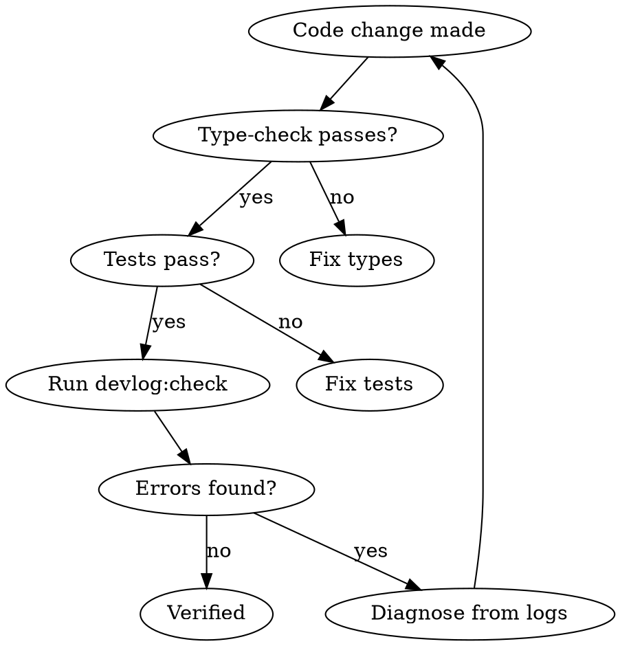

# Verify Runtime Behavior

After changing data-flow code, verify it works at runtime — not just that it compiles.

## When to Use

- Modified files in `**/api/**` or `**/shared/api/**`
- Changed dual-write, shadow-read, or mutation logic
- Fixed a data-flow bug and need evidence it's resolved

## Verification Flow



## Commands

```bash
npm run type-check      # Static types
npm run test:run        # Unit tests
npm run devlog:check    # Runtime verification (exit 1 if errors)
npm run devlog:errors   # Show warnings + errors
npm run devlog          # Show recent events
npm run devlog:trace ID # Trace one action by correlationId
```

## What to Check

| Category | Good Signal | Bad Signal |
|----------|------------|------------|
| `dual-write` | `write-success` for your entity | `write-error` or unexpected `write-skipped` |
| `shadow-read` | `compare-match` | `compare-mismatch` with missing IDs |
| Any | Events present for your change | Zero events (code path not hit) |

## Red Flags

- "It compiles, so it works" — Dual-write can compile and silently fail at runtime.
- "No errors in the log" — Check that events WERE logged. Zero events means the code path wasn't exercised.
- "I can't start the dev server" — Note the verification gap. Run `devlog:check` after available test runs.

## Log Format

Files: `.logs/dev-*.jsonl` — one JSON object per line.

Each entry has: `timestamp`, `category`, `event`, `level` (info/warn/error), `correlationId`, optional `data` and `duration`.

Grep patterns:
- All errors: `grep '"level":"error"' .logs/dev-*.jsonl`
- Dual-write issues: `grep '"category":"dual-write"' .logs/dev-*.jsonl`
- Mismatches: `grep '"event":"compare-mismatch"' .logs/dev-*.jsonl`
