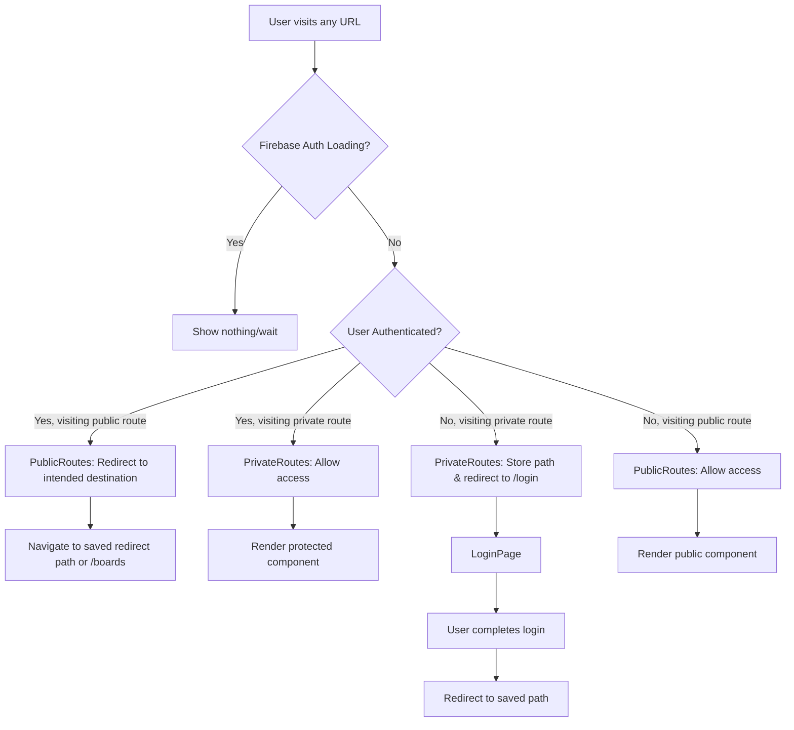

# Authentication & Routing Architecture

This document explains the authentication and routing logic for the DailyWritingFriends application. Use this as a reference when adding new routes or implementing features that require user authentication.

## Overview

The app uses **React Router v6.4 Data API** with custom authentication guards to protect routes and manage user sessions. Authentication is handled by **Firebase Auth** with session persistence, and data fetching uses a hybrid approach of **React Router loaders** for initial page loads and **React Query** for dynamic data.

## Authentication Flow



## Route Structure

```mermaid
graph TD
    A[/ - RootLayout] --> B[Index Route]
    A --> C[Public Routes]
    A --> D[Private Routes]
    
    B --> B1[RootRedirect Component]
    B1 --> B2{User Authenticated?}
    B2 -->|Yes| B3[Redirect to /boards]
    B2 -->|No| B4[Redirect to /join]
    
    C --> C1[PublicRoutes Guard]
    C1 --> C2[/login - LoginPage]
    C1 --> C3[/join - JoinIntroPage]
    
    D --> D1[PrivateRoutes Guard]
    D1 --> D2[BottomNavigatorLayout]
    D1 --> D3[Full Screen Routes]
    
    D2 --> D2A[/boards - RecentBoard]
    D2 --> D2B[/boards/list - BoardListPage with loader]
    D2 --> D2C[/board/:boardId - BoardPage with loader]
    D2 --> D2D[/create/:boardId - PostCreationPage with action]
    D2 --> D2E[/create/:boardId/completion - PostCompletionPage]
    D2 --> D2F[/board/:boardId/topic-cards - TopicCardCarouselPage]
    D2 --> D2G[/board/:boardId/post/:postId - PostDetailPage with loader]
    D2 --> D2H[/board/:boardId/edit/:postId - PostEditPage with loader]
    D2 --> D2I[/notifications - NotificationsPage]
    D2 --> D2J[/notifications/settings - NotificationSettingPage]
    D2 --> D2K[/account/edit/:userId - EditAccountPage]
    D2 --> D2L[/stats - StatsPage]
    D2 --> D2M[/user - UserPage]
    D2 --> D2N[/user/:userId - UserPage]
    D2 --> D2O[/user/settings - UserSettingPage]
    D2 --> D2P[/user/blocked-users - BlockedUsersPage]
    
    D3 --> D3A[/board/:boardId/free-writing/intro - PostFreewritingIntro]
    D3 --> D3B[/create/:boardId/free-writing - PostFreewritingPage]
    D3 --> D3C[/join/form - JoinFormPageForActiveOrNewUser]
    D3 --> D3D[/join/form/new-user - JoinFormPageForNewUser]
    D3 --> D3E[/join/form/active-user - JoinFormPageForActiveUser]
```

## Authentication Components

### 1. AuthProvider (`src/shared/hooks/useAuth.tsx`)

**Purpose**: Manages global authentication state using Firebase Auth

**Key Features**:
- Listens to Firebase Auth state changes
- Provides `currentUser`, `loading`, and redirect path management
- Persists auth state in localStorage for faster initial load
- Manages `redirectPathAfterLogin` for post-login navigation

```typescript
interface AuthContextType {
  currentUser: any; // FirebaseUser type
  loading: boolean;
  redirectPathAfterLogin: string | null;
  setRedirectPathAfterLogin: (path: string | null) => void;
}
```

### 2. PrivateRoutes (`src/shared/components/auth/RouteGuards.tsx`)

**Purpose**: Protects routes that require authentication

**Logic**:
1. If auth is still loading → render nothing (prevent flash)
2. If auth loaded and no user → save current path and redirect to `/login`
3. If auth loaded and user exists → render protected content

**Usage**: Wrap routes that require login

```typescript
// In router.tsx
{
  path: '',
  element: <PrivateRoutes />,
  children: [
    // All protected routes go here
  ]
}
```

### 3. PublicRoutes (`src/shared/components/auth/RouteGuards.tsx`)

**Purpose**: Handles routes accessible to non-authenticated users

**Logic**:
1. If user is authenticated → redirect to `redirectPathAfterLogin` or home
2. If user is not authenticated → allow access to public routes

**Usage**: Wrap routes like `/login`, `/join`

### 4. RootRedirect (`src/shared/components/auth/RootRedirect.tsx`)

**Purpose**: Handles the root path (`/`) redirection

**Logic**:
- Authenticated users → `/boards`
- Non-authenticated users → `/join` (official landing page)

## Data Fetching Architecture

### Router Loaders vs React Query

The app uses a **hybrid approach**:

#### Router Loaders
- **When**: Initial page data that's essential for rendering
- **Examples**: `boardsLoader`, `postDetailLoader`
- **Benefits**: Automatic revalidation after actions, integrated with routing
- **Auth Handling**: Use `getCurrentUser()` utility that waits for auth

```typescript
export async function boardsLoader() {
  const currentUser = await getCurrentUser();
  if (!currentUser) {
    return { boards: [] }; // Let route guards handle auth
  }
  // ... fetch data
}
```

#### React Query
- **When**: Dynamic data, infinite scrolling, real-time updates
- **Examples**: Posts list with infinite scroll, comments, reactions
- **Benefits**: Advanced caching, background updates, optimistic updates
- **Auth Handling**: Use `useAuth()` hook in components

### Cache Invalidation Strategy

When using React Router actions that modify data displayed via React Query:

```typescript
// In router actions
import { queryClient } from '@/shared/lib/queryClient';

export async function createPostAction({ request, params }: ActionFunctionArgs) {
  // ... create post logic
  
  // Manually invalidate React Query cache
  queryClient.invalidateQueries({
    queryKey: ['posts', boardId],
  });
  
  return redirect('/success');
}
```

## Adding New Routes

### 1. Public Route (No auth required)

```typescript
// In router.tsx under PublicRoutes children
{
  path: 'new-public-page',
  element: <NewPublicPage />,
}
```

### 2. Private Route (Auth required)

```typescript
// In router.tsx under PrivateRoutes children
{
  path: 'new-private-page',
  element: <NewPrivatePage />,
  loader: newPrivatePageLoader, // Optional
}
```

### 3. Route with Data Loading

```typescript
// Create loader function
export async function newPrivatePageLoader({ params }: LoaderFunctionArgs) {
  const currentUser = await getCurrentUser();
  if (!currentUser) {
    return { data: null }; // Route guards handle auth redirect
  }
  
  const data = await fetchSomeData(currentUser.uid);
  return { data };
}

// In component
export default function NewPrivatePage() {
  const { data } = useLoaderData();
  // Component logic
}
```

### 4. Route with Form Actions

```typescript
// Create action function
export async function newPageAction({ request, params }: ActionFunctionArgs) {
  const formData = await request.formData();
  
  // Process form data
  await createSomething(formData);
  
  // Invalidate relevant caches
  queryClient.invalidateQueries({
    queryKey: ['relevant-data'],
  });
  
  return redirect('/success-page');
}

// In component
export default function NewPageWithForm() {
  return (
    <Form method="post">
      {/* Form fields */}
    </Form>
  );
}
```

## Best Practices

### 1. Authentication in Loaders
- Always use `getCurrentUser()` which waits for auth initialization
- Return empty/default data instead of throwing auth errors
- Let route guards handle authentication redirects

### 2. Cache Management
- Router actions only revalidate router loaders, not React Query
- Manually invalidate React Query cache when actions modify data
- Use specific query keys for targeted invalidation

### 3. Route Protection
- Use `PrivateRoutes` for authenticated-only pages
- Use `PublicRoutes` for login/join pages that should redirect if already logged in
- Store intended destination in `redirectPathAfterLogin` for better UX

### 4. Error Handling
- Loaders should throw `Response` objects for HTTP errors
- Use error boundaries for component-level errors
- Provide fallback UI for auth loading states

### 5. Performance
- Route guards return `null` during loading to prevent flashing
- React Query provides background refetching and stale-while-revalidate
- Use appropriate cache times and stale times for your data patterns

## Debugging Auth Issues

Common issues and solutions:

1. **Infinite redirects**: Check if route guards are conflicting with loaders
2. **Flash of wrong content**: Ensure loading states return `null` not redirects
3. **Stale data after mutations**: Add manual React Query cache invalidation
4. **Auth state not updating**: Check Firebase Auth configuration and persistence settings

Use browser dev tools to inspect:
- Network tab for Firebase Auth requests
- React Query dev tools for cache state
- Console for auth state change logs