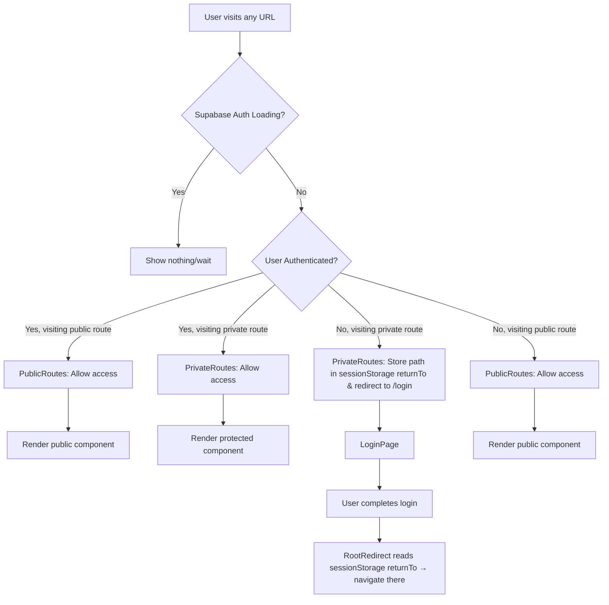
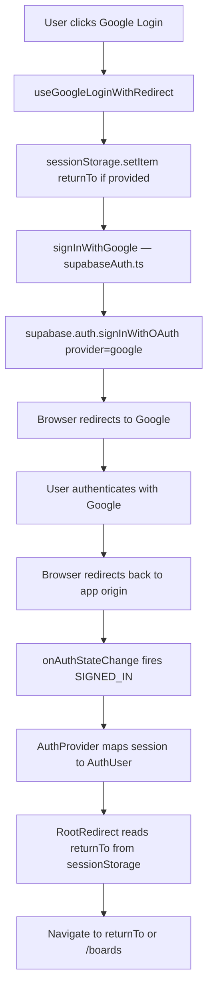

# Authentication & Routing Architecture

This document explains the authentication and routing logic for the DailyWritingFriends application. Use this as a reference when adding new routes or implementing features that require user authentication.

## Overview

The app uses **React Router v6.4 Data API** with custom authentication guards to protect routes and manage user sessions. Authentication is handled by **Supabase Auth** (Google OAuth + email/password) with session persistence, and data fetching uses a hybrid approach of **React Router loaders** for initial page loads and **React Query** for dynamic data.

## AuthUser Type

**Location**: `src/shared/hooks/useAuth.tsx`

`AuthUser` is a project-local interface that wraps Supabase's `User` type. It maps Supabase fields to a stable interface so consumer components can use `currentUser.uid` without depending on Supabase internals.

```typescript
export interface AuthUser {
  uid: string;          // Supabase user.id (UUID)
  email: string | null;
  displayName: string | null;
  photoURL: string | null;
}
```

`mapToAuthUser(user)` (in `src/shared/auth/supabaseAuth.ts`) converts a Supabase `User` to `AuthUser`.

## Authentication Flow


```mermaid
graph TD
    A[User visits any URL] --> B{Supabase Auth Loading?}
    B -->|Yes| C[Show nothing/wait]
    B -->|No| D{User Authenticated?}

    D -->|Yes, visiting public route| E[PublicRoutes: Allow access]
    D -->|Yes, visiting private route| F[PrivateRoutes: Allow access]
    D -->|No, visiting private route| G[PrivateRoutes: Store path in sessionStorage returnTo & redirect to /login]
    D -->|No, visiting public route| H[PublicRoutes: Allow access]

    E --> I[Render public component]
    F --> J[Render protected component]
    G --> K[LoginPage]
    H --> L[Render public component]

    K --> M[User completes login]
    M --> N[RootRedirect reads sessionStorage returnTo → navigate there]
```

### Post-Login Redirect Flow

The app uses `sessionStorage['returnTo']` (not a React state field) to remember where a user was trying to go before being redirected to `/login`.

1. `PrivateRoutes` calls `resolvePrivateRoute` (pure fn in `src/shared/utils/routingDecisions.ts`). On redirect, it writes `sessionStorage.setItem('returnTo', pathname)`.
2. After login, `RootRedirect` reads `sessionStorage.getItem('returnTo')` and navigates there, then clears the key.
3. `useGoogleLoginWithRedirect` can also write `sessionStorage['returnTo']` before triggering the OAuth redirect.

### Google OAuth Flow


```mermaid
graph TD
    A[User clicks Google Login] --> B[useGoogleLoginWithRedirect]
    B --> C[sessionStorage.setItem returnTo if provided]
    C --> D[signInWithGoogle — supabaseAuth.ts]
    D --> E[supabase.auth.signInWithOAuth provider=google]
    E --> F[Browser redirects to Google]
    F --> G[User authenticates with Google]
    G --> H[Browser redirects back to app origin]
    H --> I[onAuthStateChange fires SIGNED_IN]
    I --> J[AuthProvider maps session to AuthUser]
    J --> K[RootRedirect reads returnTo from sessionStorage]
    K --> L[Navigate to returnTo or /boards]
```

## Supabase Auth Functions

**Location**: `src/shared/auth/supabaseAuth.ts`

| Function | Description |
|---|---|
| `signInWithGoogle()` | Triggers Supabase OAuth redirect to Google |
| `signOutUser()` | Signs out the current session |
| `signInWithEmail(email, password)` | Email + password sign-in |
| `signUpWithEmail(email, password)` | Email + password registration (triggers OTP email) |
| `verifyOtpForSignup(email, token)` | Verifies 6-digit OTP from confirmation email |
| `sendPasswordResetEmail(email)` | Sends password reset link |
| `setPasswordForCurrentUser(password)` | Updates password for the active session |
| `mapToAuthUser(user)` | Converts Supabase `User` → `AuthUser` |

## Authentication Components

### 1. AuthProvider (`src/shared/hooks/useAuth.tsx`)

**Purpose**: Manages global authentication state using Supabase Auth.

**Key Features**:
- Subscribes to `supabase.auth.onAuthStateChange`, which fires `INITIAL_SESSION` on mount (no separate `getSession()` call needed).
- Persists `AuthUser` in `localStorage['currentUser']` for synchronous initial render.
- Calls `createUserIfNotExists` on `SIGNED_IN` and `INITIAL_SESSION` events (idempotent — once per session).
- Syncs user state to Sentry on each change.

**Context shape** (`AuthContextType`):

```typescript
interface AuthContextType {
  currentUser: AuthUser | null;
  loading: boolean;
}
```

**Usage**:

```typescript
const { currentUser, loading } = useAuth();
```

### 2. PrivateRoutes (`src/shared/components/auth/RouteGuards.tsx`)

**Purpose**: Protects routes that require authentication.

**Logic** (delegated to `resolvePrivateRoute` in `src/shared/utils/routingDecisions.ts`):
1. If auth is still loading → render `null` (prevents flash)
2. If auth loaded and no user → write `sessionStorage['returnTo']` and `<Navigate to="/login" replace />`
3. If auth loaded and user exists → render `<Outlet />`

**Usage**:

```typescript
// In router.tsx
{
  path: '',
  element: <PrivateRoutes />,
  children: [
    // All protected routes go here
  ]
}
```

### 3. PublicRoutes (`src/shared/components/auth/RouteGuards.tsx`)

**Purpose**: Passes through to public routes without any auth checks.

**Logic**: Always renders `<Outlet />` — no redirects.

**Usage**: Wrap routes like `/login`, `/join` that should be accessible to everyone.

### 4. RootRedirect (`src/shared/components/auth/RootRedirect.tsx`)

**Purpose**: Handles the root path (`/`) redirection.

**Logic** (delegated to `resolveRootRedirect` in `src/shared/utils/routingDecisions.ts`):
- While any loading flag is true → render `null`
- Not authenticated → `/join`
- Has a valid `sessionStorage['returnTo']` path → navigate there (then clear the key)
- Active cohort member → `/boards`
- In waiting list → `/boards`
- Onboarding not complete → `/join/onboarding`
- Otherwise → `/join`

## Data Fetching Architecture

### Router Loaders vs React Query

The app uses a **hybrid approach**:

#### Router Loaders
- **When**: Initial page data that's essential for rendering
- **Examples**: `boardsLoader`, `postDetailLoader`
- **Benefits**: Automatic revalidation after actions, integrated with routing
- **Auth Handling**: Use `getCurrentUser()` from `src/shared/utils/authUtils.ts`

```typescript
export async function boardsLoader() {
  const currentUser = await getCurrentUser();
  if (!currentUser) {
    return { boards: [] }; // Let route guards handle auth redirect
  }
  // ... fetch data
}
```

`getCurrentUser()` calls `supabase.auth.getSession()` and maps the result to `AuthUser | null`. It signs out sessions with a non-UUID user id (legacy Firebase UIDs) to force re-login.

#### React Query
- **When**: Dynamic data, infinite scrolling, real-time updates
- **Examples**: Posts list with infinite scroll, comments, reactions
- **Benefits**: Advanced caching, background updates, optimistic updates
- **Auth Handling**: Use `useAuth()` hook in components

### Cache Invalidation Strategy

When using React Router actions that modify data displayed via React Query:

```typescript
// In router actions
import { queryClient } from '@/shared/lib/queryClient';

export async function createPostAction({ request, params }: ActionFunctionArgs) {
  // ... create post logic

  // Manually invalidate React Query cache
  queryClient.invalidateQueries({
    queryKey: ['posts', boardId],
  });

  return redirect('/success');
}
```

## Custom Authentication Hooks

### useGoogleLoginWithRedirect

**Purpose**: Initiates Google OAuth sign-in, optionally storing a `returnTo` path.

**Location**: `src/login/hooks/useGoogleLoginWithRedirect.ts`

**Signature**:

```typescript
function useGoogleLoginWithRedirect(): {
  handleLogin: (returnTo?: string) => Promise<void>;
  isLoading: boolean;
  error: Error | null;
}
```

**Behavior**:
1. If `returnTo` is provided, writes it to `sessionStorage['returnTo']`.
2. Calls `signInWithGoogle()` — this triggers an OAuth redirect; the page unloads.
3. On return from Google, `onAuthStateChange` fires `SIGNED_IN`; `RootRedirect` reads `sessionStorage['returnTo']` and navigates.

### useIsCurrentUserActive

**Purpose**: Checks if the current user has access to the active cohort's board.

**Location**: `src/login/hooks/useIsCurrentUserActive.ts`

**Returns**: `{ isCurrentUserActive: boolean; isLoading: boolean }`

## Adding New Routes

### 1. Public Route (No auth required)

```typescript
// In router.tsx under PublicRoutes children
{
  path: 'new-public-page',
  element: <NewPublicPage />,
}
```

### 2. Private Route (Auth required)

```typescript
// In router.tsx under PrivateRoutes children
{
  path: 'new-private-page',
  element: <NewPrivatePage />,
  loader: newPrivatePageLoader, // Optional
}
```

### 3. Route with Data Loading

```typescript
// Create loader function
export async function newPrivatePageLoader({ params }: LoaderFunctionArgs) {
  const currentUser = await getCurrentUser();
  if (!currentUser) {
    return { data: null }; // Route guards handle auth redirect
  }

  const data = await fetchSomeData(currentUser.uid);
  return { data };
}

// In component
export default function NewPrivatePage() {
  const { data } = useLoaderData();
  // Component logic
}
```

### 4. Route with Form Actions

```typescript
// Create action function
export async function newPageAction({ request, params }: ActionFunctionArgs) {
  const formData = await request.formData();

  // Process form data
  await createSomething(formData);

  // Invalidate relevant caches
  queryClient.invalidateQueries({
    queryKey: ['relevant-data'],
  });

  return redirect('/success-page');
}

// In component
export default function NewPageWithForm() {
  return (
    <Form method="post">
      {/* Form fields */}
    </Form>
  );
}
```

## Best Practices

### 1. Authentication in Loaders
- Always use `getCurrentUser()` (from `src/shared/utils/authUtils.ts`) which resolves the Supabase session asynchronously.
- Return empty/default data instead of throwing auth errors from loaders.
- Let route guards (`PrivateRoutes`) handle authentication redirects.

### 2. Cache Management
- Router actions only revalidate router loaders, not React Query.
- Manually invalidate React Query cache when actions modify data.
- Use specific query keys for targeted invalidation.

### 3. Route Protection
- Use `PrivateRoutes` for authenticated-only pages.
- Use `PublicRoutes` for pages that should be accessible to everyone (e.g., login, join, marketing pages).
- The redirect destination is stored in `sessionStorage['returnTo']`, not in React state.

### 4. Error Handling
- Loaders should throw `Response` objects for HTTP errors (caught by `PermissionErrorBoundary`).
- Use `ErrorBoundary` for component tree errors.
- Provide `null` fallback during auth loading to prevent flashing.

### 5. Performance
- Route guards return `null` during loading to prevent flashing.
- React Query provides background refetching and stale-while-revalidate.
- `AuthProvider` hydrates `currentUser` synchronously from `localStorage` on first render so the initial paint is not blocked.

## Debugging Auth Issues

Common issues and solutions:

1. **Infinite redirects**: Check if route guards are conflicting with loaders.
2. **Flash of wrong content**: Ensure loading states return `null`, not redirects.
3. **Stale data after mutations**: Add manual React Query cache invalidation.
4. **Auth state not updating**: Check `supabase.auth.onAuthStateChange` subscription and Supabase project settings.
5. **returnTo not consumed**: Verify `RootRedirect` reads `sessionStorage.getItem('returnTo')` before calling `resolveRootRedirect` and clears it after navigation.

Use browser dev tools to inspect:
- Network tab for Supabase Auth requests (POST `/auth/v1/token`)
- Application → Session Storage for `returnTo`
- Application → Local Storage for `currentUser`
- React Query dev tools for cache state
- Console for auth state change logs