# Agent Observability Layer - Implementation Plan

> **For Claude:** REQUIRED SUB-SKILL: Use superpowers:executing-plans to implement this plan task-by-task.

**Goal:** Add a lightweight, file-based observability layer that lets coding agents verify runtime behavior after making changes — as a default quality check alongside lint and typecheck.

**Architecture:** A browser-side `devLog()` function sends structured JSON events to a Vite dev middleware, which appends them to `.logs/dev-{session}.jsonl`. CLI scripts query the logs. A custom skill teaches the agent to use it automatically.

**Tech Stack:** Vite plugin (Node), browser fetch API, JSONL format, `tsx` for CLI scripts

---

## Task 1: Create the `devLog` browser-side utility

**Files:**
- Create: `src/shared/utils/devLog.ts`
- Test: `src/shared/utils/devLog.test.ts`

### Step 1: Write the failing test

```typescript
// src/shared/utils/devLog.test.ts
import { describe, it, expect, vi, beforeEach, afterEach } from 'vitest';
import { buildLogEntry, DevLogLevel } from './devLog';

describe('buildLogEntry', () => {
  beforeEach(() => {
    vi.useFakeTimers();
    vi.setSystemTime(new Date('2026-02-18T10:00:00Z'));
  });

  afterEach(() => {
    vi.useRealTimers();
  });

  it('creates a structured log entry with required fields', () => {
    const entry = buildLogEntry({
      category: 'dual-write',
      event: 'write-success',
      data: { entityType: 'post', entityId: 'abc123' },
    });

    expect(entry).toMatchObject({
      category: 'dual-write',
      event: 'write-success',
      level: 'info',
      data: { entityType: 'post', entityId: 'abc123' },
    });
    expect(entry.timestamp).toBe('2026-02-18T10:00:00.000Z');
    expect(entry.correlationId).toMatch(/^[a-z0-9-]+$/);
  });

  it('uses the provided level', () => {
    const entry = buildLogEntry({
      category: 'dual-write',
      event: 'write-error',
      level: 'error',
    });

    expect(entry.level).toBe('error');
  });

  it('includes correlationId when provided', () => {
    const entry = buildLogEntry({
      category: 'dual-write',
      event: 'write-success',
      correlationId: 'my-correlation-id',
    });

    expect(entry.correlationId).toBe('my-correlation-id');
  });
});
```

### Step 2: Run test to verify it fails

Run: `npm run test:run -- src/shared/utils/devLog.test.ts`
Expected: FAIL — module `./devLog` does not export `buildLogEntry`

### Step 3: Write minimal implementation

```typescript
// src/shared/utils/devLog.ts

export type DevLogLevel = 'info' | 'warn' | 'error';

export interface DevLogEntry {
  timestamp: string;
  category: string;
  event: string;
  level: DevLogLevel;
  correlationId: string;
  data?: Record<string, unknown>;
  duration?: number;
}

export interface DevLogOptions {
  category: string;
  event: string;
  level?: DevLogLevel;
  correlationId?: string;
  data?: Record<string, unknown>;
  duration?: number;
}

let _activeCorrelationId: string | null = null;

/** Start a correlation scope for grouping related events */
export function startCorrelation(id?: string): string {
  _activeCorrelationId = id ?? crypto.randomUUID();
  return _activeCorrelationId;
}

/** End the active correlation scope */
export function endCorrelation(): void {
  _activeCorrelationId = null;
}

/** Build a structured log entry (pure function, testable) */
export function buildLogEntry(options: DevLogOptions): DevLogEntry {
  return {
    timestamp: new Date().toISOString(),
    category: options.category,
    event: options.event,
    level: options.level ?? 'info',
    correlationId: options.correlationId ?? _activeCorrelationId ?? crypto.randomUUID(),
    ...(options.data && { data: options.data }),
    ...(options.duration !== undefined && { duration: options.duration }),
  };
}

const DEV_LOG_ENDPOINT = '/__dev/log';

/**
 * Emit a structured dev log event.
 * In development: sends to Vite middleware which writes JSONL to disk.
 * In production: no-op.
 */
export function devLog(options: DevLogOptions): void {
  if (import.meta.env.PROD) return;

  const entry = buildLogEntry(options);

  // Fire-and-forget — never block UI
  fetch(DEV_LOG_ENDPOINT, {
    method: 'POST',
    headers: { 'Content-Type': 'application/json' },
    body: JSON.stringify(entry),
  }).catch(() => {
    // Silently ignore if middleware not available
  });
}
```

### Step 4: Run test to verify it passes

Run: `npm run test:run -- src/shared/utils/devLog.test.ts`
Expected: PASS

### Step 5: Commit

```bash
git add src/shared/utils/devLog.ts src/shared/utils/devLog.test.ts
git commit -m "feat: add devLog utility for agent observability"
```

---

## Task 2: Create the Vite dev plugin (browser → disk)

**Files:**
- Create: `vite-plugin-dev-log.ts`
- Modify: `vite.config.ts:102` (add plugin)

### Step 1: Write the Vite plugin

```typescript
// vite-plugin-dev-log.ts
import fs from 'fs';
import path from 'path';
import type { Plugin, ViteDevServer } from 'vite';

function getSessionLogPath(logsDir: string): string {
  const now = new Date();
  const pad = (n: number) => String(n).padStart(2, '0');
  const timestamp = `${now.getFullYear()}-${pad(now.getMonth() + 1)}-${pad(now.getDate())}-${pad(now.getHours())}${pad(now.getMinutes())}${pad(now.getSeconds())}`;
  return path.join(logsDir, `dev-${timestamp}.jsonl`);
}

export default function devLogPlugin(): Plugin {
  let logPath: string;

  return {
    name: 'dev-log',
    apply: 'serve', // dev only — stripped from production builds

    configureServer(server: ViteDevServer) {
      const logsDir = path.resolve(process.cwd(), '.logs');
      fs.mkdirSync(logsDir, { recursive: true });
      logPath = getSessionLogPath(logsDir);

      // POST /__dev/log — append a JSON line
      server.middlewares.use('/__dev/log', (req, res, next) => {
        if (req.method !== 'POST') return next();

        let body = '';
        req.on('data', (chunk: Buffer) => { body += chunk.toString(); });
        req.on('end', () => {
          try {
            // Validate JSON before writing
            JSON.parse(body);
            fs.appendFileSync(logPath, body + '\n');
            res.writeHead(204);
            res.end();
          } catch {
            res.writeHead(400);
            res.end('Invalid JSON');
          }
        });
      });

      // GET /__dev/logs — return last N lines
      server.middlewares.use('/__dev/logs', (req, res, next) => {
        if (req.method !== 'GET') return next();

        try {
          if (!fs.existsSync(logPath)) {
            res.writeHead(200, { 'Content-Type': 'application/json' });
            res.end('[]');
            return;
          }

          const content = fs.readFileSync(logPath, 'utf-8');
          const lines = content.trim().split('\n').filter(Boolean);

          // Parse URL params for limit
          const url = new URL(req.url ?? '/', `http://localhost`);
          const limit = parseInt(url.searchParams.get('limit') ?? '50', 10);
          const recent = lines.slice(-limit);

          res.writeHead(200, { 'Content-Type': 'application/json' });
          res.end(JSON.stringify(recent.map((l) => JSON.parse(l))));
        } catch {
          res.writeHead(500);
          res.end('Error reading logs');
        }
      });

      // GET /__dev/logs/path — return the log file path (for agent to Read)
      server.middlewares.use('/__dev/logs/path', (req, res, next) => {
        if (req.method !== 'GET') return next();
        res.writeHead(200, { 'Content-Type': 'text/plain' });
        res.end(logPath);
      });
    },
  };
}
```

### Step 2: Register the plugin in vite.config.ts

Add to `vite.config.ts` plugins array (before Sentry plugin):

```typescript
import devLogPlugin from './vite-plugin-dev-log';

// In plugins array:
plugins: [
  react(),
  devLogPlugin(),  // <-- add this
  sentryVitePlugin({ ... }),
],
```

### Step 3: Add `.logs/` to `.gitignore`

Append to `.gitignore`:
```
# Agent observability logs
.logs/
```

### Step 4: Verify manually

Run: `npm run dev`
Then: `curl -X POST http://localhost:5173/__dev/log -H 'Content-Type: application/json' -d '{"test":true}'`
Then: `curl http://localhost:5173/__dev/logs`
Expected: Returns `[{"test":true}]`

### Step 5: Commit

```bash
git add vite-plugin-dev-log.ts vite.config.ts .gitignore
git commit -m "feat: add Vite dev-log plugin for agent observability"
```

---

## Task 3: Instrument `dualWrite.ts`

**Files:**
- Modify: `src/shared/api/dualWrite.ts`

### Step 1: Add devLog calls to the dualWrite function

Import and instrument (no logic changes — observability only):

```typescript
import { devLog, startCorrelation, endCorrelation } from '@/shared/utils/devLog';
```

Add to `dualWrite()`:
- Before write: `devLog({ category: 'dual-write', event: 'write-attempt', data: { entityType, operationType, entityId } })`
- After success: `devLog({ category: 'dual-write', event: 'write-success', data: { entityType, operationType, entityId }, duration })`
- On error: `devLog({ category: 'dual-write', event: 'write-error', level: 'error', data: { entityType, operationType, entityId, error: errorMessage } })`
- On skip (disabled): `devLog({ category: 'dual-write', event: 'write-skipped', data: { reason: 'disabled' } })`
- On skip (idempotent): `devLog({ category: 'dual-write', event: 'write-skipped', data: { reason: 'idempotent', entityId } })`

### Step 2: Verify type-check passes

Run: `npm run type-check`
Expected: No new errors

### Step 3: Commit

```bash
git add src/shared/api/dualWrite.ts
git commit -m "feat: instrument dualWrite with devLog observability"
```

---

## Task 4: Instrument `shadowReads.ts`

**Files:**
- Modify: `src/shared/api/shadowReads.ts`

### Step 1: Add devLog call to `logShadowMismatch`

```typescript
import { devLog } from '@/shared/utils/devLog';
```

Add at the top of `logShadowMismatch()`:

```typescript
devLog({
  category: 'shadow-read',
  event: result.match ? 'compare-match' : 'compare-mismatch',
  level: result.match ? 'info' : 'warn',
  data: {
    queryType,
    userId,
    firestoreCount: result.firestoreCount,
    supabaseCount: result.supabaseCount,
    missingInSupabase: result.missingInSupabase.slice(0, 5),
    missingInFirestore: result.missingInFirestore.slice(0, 5),
  },
});
```

### Step 2: Verify type-check passes

Run: `npm run type-check`
Expected: No new errors

### Step 3: Commit

```bash
git add src/shared/api/shadowReads.ts
git commit -m "feat: instrument shadowReads with devLog observability"
```

---

## Task 5: Create CLI query scripts

**Files:**
- Create: `scripts/devlog.ts`

### Step 1: Write the query script

```typescript
// scripts/devlog.ts
import fs from 'fs';
import path from 'path';

const LOGS_DIR = path.resolve(process.cwd(), '.logs');

interface LogEntry {
  timestamp: string;
  category: string;
  event: string;
  level: string;
  correlationId: string;
  data?: Record<string, unknown>;
  duration?: number;
}

function getLatestLogFile(): string | null {
  if (!fs.existsSync(LOGS_DIR)) return null;
  const files = fs.readdirSync(LOGS_DIR)
    .filter((f) => f.startsWith('dev-') && f.endsWith('.jsonl'))
    .sort()
    .reverse();
  return files[0] ? path.join(LOGS_DIR, files[0]) : null;
}

function readLogEntries(filePath: string): LogEntry[] {
  const content = fs.readFileSync(filePath, 'utf-8');
  return content
    .trim()
    .split('\n')
    .filter(Boolean)
    .map((line) => JSON.parse(line) as LogEntry);
}

function formatEntry(entry: LogEntry): string {
  const level = entry.level === 'error' ? '❌' : entry.level === 'warn' ? '⚠️' : '✅';
  const duration = entry.duration ? ` (${entry.duration}ms)` : '';
  const data = entry.data ? ` ${JSON.stringify(entry.data)}` : '';
  return `${level} [${entry.timestamp}] ${entry.category}/${entry.event}${duration}${data}`;
}

const command = process.argv[2] ?? 'recent';
const logFile = getLatestLogFile();

if (!logFile) {
  if (command === 'check') {
    console.log('✅ No log file found (no dev session recorded)');
    process.exit(0);
  }
  console.log('No log files found in .logs/');
  process.exit(0);
}

const entries = readLogEntries(logFile);
console.log(`📄 Reading: ${path.basename(logFile)} (${entries.length} entries)\n`);

switch (command) {
  case 'recent': {
    const limit = parseInt(process.argv[3] ?? '20', 10);
    entries.slice(-limit).forEach((e) => console.log(formatEntry(e)));
    break;
  }

  case 'errors': {
    const errors = entries.filter((e) => e.level === 'error' || e.level === 'warn');
    if (errors.length === 0) {
      console.log('✅ No errors or warnings found');
    } else {
      console.log(`Found ${errors.length} error/warning entries:\n`);
      errors.forEach((e) => console.log(formatEntry(e)));
    }
    break;
  }

  case 'check': {
    const errors = entries.filter((e) => e.level === 'error');
    const warnings = entries.filter((e) => e.level === 'warn');
    const mismatches = entries.filter(
      (e) => e.category === 'shadow-read' && e.event === 'compare-mismatch'
    );

    console.log(`Errors:     ${errors.length}`);
    console.log(`Warnings:   ${warnings.length}`);
    console.log(`Mismatches: ${mismatches.length}`);

    if (errors.length > 0) {
      console.log('\n--- Errors ---');
      errors.forEach((e) => console.log(formatEntry(e)));
    }
    if (mismatches.length > 0) {
      console.log('\n--- Shadow Read Mismatches ---');
      mismatches.forEach((e) => console.log(formatEntry(e)));
    }

    if (errors.length > 0) {
      process.exit(1);
    }
    console.log('\n✅ DevLog check passed');
    process.exit(0);
    break;
  }

  case 'trace': {
    const correlationId = process.argv[3];
    if (!correlationId) {
      console.log('Usage: npx tsx scripts/devlog.ts trace <correlationId>');
      process.exit(1);
    }
    const traced = entries.filter((e) => e.correlationId === correlationId);
    if (traced.length === 0) {
      console.log(`No entries found for correlationId: ${correlationId}`);
    } else {
      traced.forEach((e) => console.log(formatEntry(e)));
    }
    break;
  }

  default:
    console.log('Usage: npx tsx scripts/devlog.ts [recent|errors|check|trace] [args]');
}
```

### Step 2: Add npm scripts to package.json

```json
"devlog": "tsx scripts/devlog.ts recent",
"devlog:errors": "tsx scripts/devlog.ts errors",
"devlog:check": "tsx scripts/devlog.ts check",
"devlog:trace": "tsx scripts/devlog.ts trace"
```

### Step 3: Verify it runs

Run: `npx tsx scripts/devlog.ts recent`
Expected: "No log files found in .logs/" (clean output, no crash)

### Step 4: Commit

```bash
git add scripts/devlog.ts package.json
git commit -m "feat: add devlog CLI query scripts"
```

---

## Task 6: Add AGENTS.md observability section

**Files:**
- Modify: `AGENTS.md`

### Step 1: Add section after "Build & Validation Commands"

Insert after the existing validation commands section (after line ~78):

```markdown
### Agent Observability (Runtime Verification)

After making changes to data-flow code (API calls, dual-write, mutations), verify runtime behavior:

```bash
# Check for runtime errors/mismatches in dev logs — run AFTER exercising the app
npm run devlog:check

# View recent events
npm run devlog

# View only errors and warnings
npm run devlog:errors

# Trace a single user action by correlationId
npm run devlog:trace <correlationId>
```

**When to use:** After modifying files in `src/shared/api/`, `src/post/api/`, `src/comment/api/`, or any dual-write/shadow-read logic. Start the dev server (`npm run dev:emu`), trigger the relevant user action, then run `npm run devlog:check`.

**Log location:** `.logs/dev-{session}.jsonl` — structured JSON, one event per line. Grep-friendly.

**Key event categories:**
- `dual-write` — write-attempt, write-success, write-error, write-skipped
- `shadow-read` — compare-match, compare-mismatch
```

### Step 2: Verify the markdown renders correctly

Read the file back and check formatting.

### Step 3: Commit

```bash
git add AGENTS.md
git commit -m "docs: add agent observability section to AGENTS.md"
```

---

## Task 7: Create the `verify-runtime` skill

**Files:**
- Create: `.claude/skills/verify-runtime/SKILL.md`

This task follows the **writing-skills** TDD process.

### Step 1 (RED): Run baseline — verify agent behavior WITHOUT the skill

Ask a fresh subagent to modify `dualWrite.ts` and verify the change. Observe:
- Does it check runtime logs? (Expected: NO — it doesn't know they exist)
- Does it run `devlog:check`? (Expected: NO)
- What verification does it do? (Expected: type-check + "looks right")
- Document exact rationalizations verbatim.

### Step 2 (GREEN): Write the skill addressing baseline failures

```markdown
---
name: verify-runtime
description: Use when modifying data-flow code (API calls, dual-write, mutations, database reads/writes) to verify runtime behavior via structured dev logs, before claiming the change works.
---

# Verify Runtime Behavior

## Overview

After changing data-flow code, verify it works at runtime — not just that it compiles. Use structured dev logs to check what actually happened.

## When to Use

- Modified files in `**/api/**`, `**/shared/api/**`
- Changed dual-write, shadow-read, or mutation logic
- Fixed a data flow bug and need evidence it's resolved

## Verification Flow

```dot
digraph verify {
  "Code change made" -> "Type-check passes?";
  "Type-check passes?" -> "STOP — fix types" [label="no"];
  "Type-check passes?" -> "Tests pass?" [label="yes"];
  "Tests pass?" -> "STOP — fix tests" [label="no"];
  "Tests pass?" -> "Start dev server" [label="yes"];
  "Start dev server" -> "Trigger user action";
  "Trigger user action" -> "Run devlog:check";
  "Run devlog:check" -> "Errors found?" ;
  "Errors found?" -> "Diagnose from log data" [label="yes"];
  "Diagnose from log data" -> "Code change made";
  "Errors found?" -> "Change verified ✅" [label="no"];
}
```



## Commands

```bash
npm run type-check          # Layer 1: static types
npm run test:run            # Layer 1: unit tests
npm run devlog:check        # Layer 2: runtime verification (exit 1 if errors)
npm run devlog:errors       # Layer 2: show warnings + errors
npm run devlog:trace <id>   # Layer 2: trace one action end-to-end
```

## Red Flags — STOP

- "It compiles, so it works" — **NO.** Dual-write can compile perfectly and silently fail at runtime.
- "I can't run the dev server" — Run `devlog:check` after tests at minimum. Note the gap.
- "No errors in the log, so it's fine" — Check that events WERE logged. Zero events may mean the code path wasn't exercised.

## What to Look For

| Category | Good | Bad |
|----------|------|-----|
| `dual-write` | `write-success` for your entity | `write-error`, `write-skipped` unexpectedly |
| `shadow-read` | `compare-match` | `compare-mismatch` with missing IDs |
| Any | Events present for your change | Zero events (code path not hit) |
```

### Step 3 (GREEN): Re-run baseline WITH the skill

Ask the same subagent to modify `dualWrite.ts` with the skill loaded. Verify:
- Does it run `devlog:check`? (Expected: YES)
- Does it check for events in the log? (Expected: YES)
- Does it cite runtime evidence? (Expected: YES)

### Step 4 (REFACTOR): Close loopholes

If the agent found workarounds or missed steps, update the skill to address them. Re-test.

### Step 5: Commit

```bash
git add .claude/skills/verify-runtime/SKILL.md
git commit -m "feat: add verify-runtime skill for agent observability"
```

---

## Task 8: Wire into default quality checks

**Files:**
- Modify: `AGENTS.md` (pre-commit checklist)
- Modify: `package.json` (add combined check script)

### Step 1: Add a combined validation script

Add to `package.json` scripts:

```json
"validate": "npm run type-check && npm run lint && npm run test:run",
"validate:full": "npm run type-check && npm run lint && npm run test:run && npm run devlog:check"
```

`validate:full` includes runtime verification — agents should use this after exercising the app.

### Step 2: Update AGENTS.md pre-PR checklist

Update the "Before submitting PR, ensure:" section to include:

```markdown
**Before submitting PR, ensure:**
- `npm run type-check` passes
- `npm run test:run` passes
- `npm run build` completes successfully
- `npm run devlog:check` passes (if data-flow code changed)
- For functions changes: `cd functions && npm test` passes
```

### Step 3: Commit

```bash
git add package.json AGENTS.md
git commit -m "feat: add devlog:check to default validation pipeline"
```

---

## Summary

| Task | What | Files | ~Lines |
|------|------|-------|--------|
| 1 | `devLog` utility + tests | `src/shared/utils/devLog.ts`, `.test.ts` | ~80 |
| 2 | Vite dev plugin | `vite-plugin-dev-log.ts`, `vite.config.ts` | ~80 |
| 3 | Instrument `dualWrite.ts` | `src/shared/api/dualWrite.ts` | ~15 |
| 4 | Instrument `shadowReads.ts` | `src/shared/api/shadowReads.ts` | ~10 |
| 5 | CLI query scripts | `scripts/devlog.ts`, `package.json` | ~120 |
| 6 | AGENTS.md section | `AGENTS.md` | ~20 |
| 7 | `verify-runtime` skill (TDD) | `.claude/skills/verify-runtime/SKILL.md` | ~60 |
| 8 | Default quality check integration | `package.json`, `AGENTS.md` | ~10 |

**Total: ~395 lines of new code across 8 tasks, 8 commits.**

## Future Instrumentation Points (not in this plan)

Once the core layer is in place, these can be added incrementally:
- React Query mutation wrapper (broad coverage for all mutations)
- Supabase read logging (when `VITE_READ_SOURCE=supabase`)
- Cloud Functions event logging (in emulator)
- Comment suggestion AI pipeline tracing
