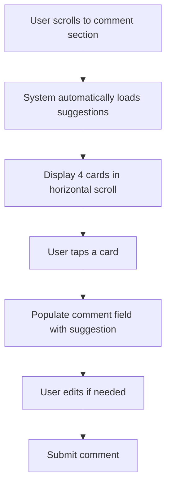

# Smart Comment Assistant PRD

## 1. Executive Summary

### Product Vision

An AI-powered comment assistant that learns individual user writing styles and generates personalized comment suggestions, reducing the psychological burden of commenting while maintaining authentic personal voice.

### Key Metrics Goal

- **Primary**: Increase comment engagement rate by 30% within 8 weeks
- **Secondary**: Reduce user churn at week 3 by 20%

## 2. Problem Statement

### User Research Findings

Based on user interviews with 15 active users (5-100 posts/comments history each):

#### Pain Points

1. Psychological Burden
   - "I feel my comments are too generic"
   - "I need to say something meaningful but don't know what"
   - "I want to be witty but can't think of anything"
2. Time Investment: Average time to write a comment: 1-3 minutes
3. Engagement Drop over time

### Root Cause Analysis

Users experience "comment fatigue" - the cognitive load of crafting meaningful responses daily becomes unsustainable.

## 3. Solution Design

### 3.1 Core Functionality

#### Feature Overview

AI generates 4 context-aware, personalized comment suggestions based on:

- User's historical commenting style
- Post content and emotional tone
- Author-reader relationship context

#### User Journey



### 3.2 Comment Generation Types

| Type                       | Description                   | Trigger Context                  | Example Output                                   |
| -------------------------- | ----------------------------- | -------------------------------- | ------------------------------------------------ |
| **Trait Recognition**      | Identifies personality/values | Posts revealing character traits | "Your perfectionist side really shows here"      |
| **Highlight Appreciation** | Praises specific expressions  | Posts with unique phrases        | "The metaphor about 'time melting' is brilliant" |
| **Empathy Response**       | Emotional connection          | Posts expressing feelings        | "I've been there too, it's really tough"         |
| **Curiosity Driver**       | Encourages elaboration        | Posts with incomplete narratives | "What happened after the meeting?"               |

### 3.3 Comment Style Data Generation (IMPLEMENTED)

#### Data Collection Strategy

```
Active Users Identified
    ↓
Real-time: New Comments Processed Automatically
    ↓
Backfill: Historical Comments (10 per user)
    ↓
LLM Analysis: 50-char Summary + Tone + Mood
    ↓
Store in commentStyleData Collection
```

#### Implemented Data Structure

```typescript
interface CommentStyleData {
  id: string;
  userId: string;           // Comment author
  postId: string;          // Post being commented on  
  boardId: string;         // Board ID
  postSummary: string;     // 50-char LLM-generated summary
  postTone: PostTone;      // Writer's style (11 categories)
  postMood: PostMood;      // Emotional atmosphere (7 categories)
  userComment: string;     // Original comment text
  createdAt: Timestamp;    // Comment creation time
  processedAt: Timestamp;  // Processing time
}

// 11 Tone Categories (Writer's Style)
type PostTone = 'thoughtful' | 'warm' | 'emotional' | 'humorous' 
  | 'serious' | 'informal' | 'formal' | 'optimistic' 
  | 'calm' | 'guiding' | 'friendly';

// 7 Mood Categories (Emotional Atmosphere)  
type PostMood = 'happy_uplifting' | 'sad_gloomy' | 'tense_exciting'
  | 'romantic_loving' | 'mysterious_curious' | 'funny_lighthearted'
  | 'peaceful_calm';
```

### 3.4 Post Tone Analysis

#### Emotion Detection Categories

| Tone Category             | Keywords/Patterns        | Comment Tone Adjustment |
| ------------------------- | ------------------------ | ----------------------- |
| **Serious/Contemplative** | "고민", "생각", "깨달음" | Thoughtful, measured    |
| **Joyful/Excited**        | "기쁨", "설렘", "성공"   | Celebratory, energetic  |
| **Daily/Casual**          | "오늘", "일상", "평범"   | Relaxed, conversational |
| **Humorous/Light**        | "ㅋㅋ", "웃긴", "재미"   | Playful, witty          |
| **Sad/Struggling**        | "힘듦", "우울", "지침"   | Gentle, supportive      |

### 3.5 Prompt Length Optimization

#### Token-Efficient Strategy

```typescript
interface PromptOptimization {
  // Historical comments (for style learning)
  maxHistoricalPostContext: 50;    // Only key phrases from past posts
  minCommentHistory: 3;             // Minimum for style learning
  maxCommentHistory: 12;            // More examples = better style matching
  
  // Target post (what we're commenting on)
  maxTargetPostLength: 1500;       // Keep target post fuller
  
  // Token allocation
  totalTokenBudget: 2500;
  historicalTokens: 800;            // 10 examples × 80 tokens
  targetPostTokens: 500;            // Full current post
  instructionTokens: 300;           // Prompt instructions
  bufferTokens: 900;                // Safety margin
}
```

#### Token Allocation Comparison

| Component | Old Approach | New Approach | Savings |
|-----------|--------------|--------------|---------|
| Historical post content | 1000-1500 tokens | 200-300 tokens | 80% |
| User comments | 250 tokens | 500 tokens | +100% |
| Total examples | 5 | 10-12 | +140% |
| Target post | 300 tokens | 500 tokens | +67% |

#### Benefits
- **3x more style examples** for accurate personalization
- **70% token reduction** overall
- **Fuller target post** context (less truncation)
- **Faster API response** from smaller prompts

## 4. Technical Implementation

### 4.1 System Architecture

```
┌─────────────────┐     ┌──────────────────┐     ┌─────────────────┐
│   Frontend      │────▶│  Cloud Function  │────▶│  Gemini API     │
│  (React/TS)     │◀────│   (Firebase)     │◀────│  (Gen AI)       │
└─────────────────┘     └──────────────────┘     └─────────────────┘
         │                        │
         ▼                        ▼
┌─────────────────┐     ┌──────────────────┐
│   Local State   │     │    Firestore     │
│   Management    │     │   (User Data)    │
└─────────────────┘     └──────────────────┘
```

### 4.2 Data Models

#### Firestore Collections

```typescript
// No style profile storage needed - direct prompt usage

// users/{userId}/generatedComments
interface GeneratedComment {
  id: string;
  postId: string;
  generatedAt: Timestamp;
  suggestions: {
    type: CommentType;
    text: string;
  }[];
  selected?: number; // Which suggestion was chosen
  finalText?: string; // After user edits
  wasSubmitted: boolean;
}

// Optimized query for comment history with key context extraction
async function getUserCommentHistory(userId: string): Promise<CommentHistoryItem[]> {
  // Get user's recent comments
  const comments = await db
    .collectionGroup('comments')
    .where('userId', '==', userId)
    .orderBy('createdAt', 'desc')
    .limit(12)  // Get more examples for better style learning
    .get();
  
  // Extract key context from associated posts
  return Promise.all(comments.docs.map(async (doc) => {
    const comment = doc.data();
    const post = await getPost(comment.postId);
    
    return {
      postKeyContext: extractKeyContext(post.content),
      userComment: comment.content,
      postMood: detectPostMood(post.content)  // Optional mood detection
    };
  }));
}

// Extract the most meaningful part of a post
function extractKeyContext(content: string): string {
  // Find emotional peaks or key questions
  const sentences = content.split(/[.!?]+/);
  
  // Priority: questions > exclamations > emotional keywords > first sentence
  const question = sentences.find(s => s.includes('?'));
  if (question) return question.trim().slice(0, 50);
  
  const exclamation = sentences.find(s => s.includes('!'));
  if (exclamation) return exclamation.trim().slice(0, 50);
  
  const emotional = sentences.find(s => 
    /기쁨|슬픔|고민|성공|실패|힘들|행복|우울/.test(s)
  );
  if (emotional) return emotional.trim().slice(0, 50);
  
  return sentences[0]?.trim().slice(0, 50) || '';
}
```

### 4.3 AI Prompt Engineering

#### Base Prompt Template

```typescript
const generateCommentPrompt = (
  targetPost: Post,
  commentHistory: CommentHistoryItem[],
): string => {
  // Format optimized comment history - focus on user's comments
  const historyExamples = commentHistory
    .slice(0, 10)  // Use 10 examples for better style learning
    .map(item => {
      const moodTag = item.postMood ? `[${item.postMood}] ` : '';
      return `${moodTag}Context: "${item.postKeyContext}"
→ Comment: "${item.userComment}"`;
    }).join('\n\n');

  // Keep target post fuller since we saved tokens on history
  const targetContent = targetPost.content.length > 1500 
    ? targetPost.content.slice(0, 1500) + '...'
    : targetPost.content;

  return `
You are generating comment suggestions for a user based on their commenting style.

## USER'S COMMENTING STYLE (10 examples):
${historyExamples}

## ANALYZE THE STYLE ABOVE:
- Comment length pattern
- Emoji usage frequency
- Formality level (반말/존댓말)
- Common expressions
- Emotional tone

## NEW POST TO COMMENT ON:
Author: ${targetPost.authorName}
"${targetContent}"

Generate 4 comment suggestions in Korean that match the user's style EXACTLY:

1. [Trait] - Point out a personality trait or value
2. [Highlight] - Praise a specific phrase or expression
3. [Empathy] - Connect emotionally with their experience  
4. [Curiosity] - Ask an engaging follow-up question

Each suggestion must:
- Match the user's typical comment length (±20%)
- Use emojis only if the user typically uses them
- Maintain the same formality level
- Sound natural, not AI-generated

Output JSON only:
{
  "suggestions": [
    {"type": "trait", "text": "..."},
    {"type": "highlight", "text": "..."},
    {"type": "empathy", "text": "..."},
    {"type": "curiosity", "text": "..."}
  ]
}
`;
};
```

### 4.4 API Endpoints

#### Cloud Function: generateCommentSuggestions

```typescript
export const generateCommentSuggestions = functions.https.onCall(
  async (data: { postId: string; userId: string }, context) => {
    // 1. Verify authentication
    if (!context.auth) throw new Error('Unauthenticated');

    // 2. Fetch target post
    const targetPost = await getPost(data.postId);

    // 3. Get user's comment history with full context
    const commentHistory = await getUserCommentHistory(data.userId);
    
    // 4. Handle new users with no history
    if (commentHistory.length < 3) {
      return { 
        suggestions: getDefaultSuggestions(targetPost),
        isDefault: true 
      };
    }

    // 5. Generate suggestions via Gemini
    const prompt = generateCommentPrompt(targetPost, commentHistory);
    const suggestions = await callGeminiAPI(prompt);

    // 6. Store for analytics
    await storeGeneratedComments(data.userId, data.postId, suggestions);

    // 7. Return suggestions
    return { suggestions, isDefault: false };
  },
);
```

### 4.5 Frontend Implementation

#### Comment Assistant Component

```typescript
interface CommentAssistantProps {
  postId: string;
  onCommentSelect: (text: string) => void;
}

export function CommentAssistant({ postId, onCommentSelect }: CommentAssistantProps) {
  const [suggestions, setSuggestions] = useState<CommentSuggestion[]>([]);
  const [loading, setLoading] = useState(true);
  const [selected, setSelected] = useState<number | null>(null);

  // Auto-load suggestions when component mounts
  useEffect(() => {
    loadSuggestions();
  }, [postId]);

  const loadSuggestions = async () => {
    setLoading(true);
    try {
      const result = await functions.httpsCallable('generateCommentSuggestions')({
        postId,
        userId: auth.currentUser?.uid,
      });
      setSuggestions(result.data.suggestions);
    } catch (error) {
      console.error('Failed to generate suggestions:', error);
      // Show generic fallback suggestions
      setSuggestions(getFallbackSuggestions());
    } finally {
      setLoading(false);
    }
  };

  if (loading) {
    return (
      <div className="comment-suggestions-container">
        {/* Skeleton loading cards */}
        <div className="horizontal-scroll">
          {[1, 2, 3, 4].map(i => (
            <div key={i} className="suggestion-card-skeleton" />
          ))}
        </div>
      </div>
    );
  }

  return (
    <div className="comment-suggestions-container">
      <div className="horizontal-scroll">
        {suggestions.map((suggestion, index) => (
          <CommentCard
            key={index}
            suggestion={suggestion}
            selected={selected === index}
            onSelect={() => {
              setSelected(index);
              onCommentSelect(suggestion.text);
              // Track analytics
              trackSuggestionSelection(index, suggestion.type);
            }}
          />
        ))}
      </div>
    </div>
  );
}
```

## 5. UX/UI Specifications

### 5.1 Visual Design

#### Automatic Display

- **Loading State**: Skeleton cards appear immediately when entering comment section
- **Ready State**: 4 cards in horizontal scroll view
- **Mobile**: Swipeable carousel with peek of next card
- **Desktop**: All 4 cards visible in single row

#### Comment Card Design

```
┌────────────────────┐
│ 💭 Type Icon       │
│                    │
│ "Generated         │
│  comment text..."  │
│                    │
│ [Tap to use]       │
└────────────────────┘
```

### 5.2 Interaction Flow

1. **Auto-trigger**: Suggestions load automatically when comment section visible
2. **Display**: Horizontal scrollable cards (150px wide each)
3. **Selection**: Single tap populates comment field instantly
4. **Editing**: Comment field becomes active with keyboard
5. **Submission**: Standard submit button flow

### 5.3 Error Handling

| Error Case           | User Message                     | Fallback Action        |
| -------------------- | -------------------------------- | ---------------------- |
| Network failure      | "Connection issue. Try again?"   | Retry button           |
| AI timeout (>5s)     | "Taking longer than usual..."    | Show generic templates |
| Insufficient history | "Building your style profile..." | Use default style      |
| Rate limit exceeded  | "Try again in a moment"          | 60-second cooldown     |

## 6. Success Metrics & KPIs

### 6.1 Primary Metrics

| Metric           | Current | Target | Measurement                             |
| ---------------- | ------- | ------ | --------------------------------------- |
| Comment rate     | 28%     | 36%    | (daily comments / daily active readers) |
| Assistant usage  | 0%      | 50%    | (AI-assisted comments / total comments) |
| Week 3 retention | 43%     | 52%    | (week 3 actives / week 1 actives)       |

### 6.2 Secondary Metrics

- **Quality Indicators**

  - Edit rate after selection: <30% (minimal edits needed)
  - Comment length variance: Maintain ±20% of user average
  - Emoji consistency: ±15% of user baseline

- **Performance Metrics**
  - P50 generation time: <2 seconds
  - P95 generation time: <4 seconds
  - Error rate: <2%

### 6.3 Qualitative Metrics

- Weekly user interviews (n=5) measuring:
  - Perceived authenticity of suggestions
  - Reduction in commenting anxiety
  - Overall satisfaction (NPS)

## 7. Launch Strategy

### 7.1 Phased Rollout

#### Phase 1: Alpha (Week 1-2)

- 10% of users (power users with 50+ comments)
- Focus: Style profile accuracy
- Success criteria: 70% selection rate

#### Phase 2: Beta (Week 3-4)

- 30% of users
- Focus: Performance at scale
- Success criteria: <2s P50 latency

#### Phase 3: General Availability (Week 5+)

- 100% of users
- Focus: Adoption and retention
- Success criteria: 36% comment rate

### 7.2 A/B Testing Plan

| Test             | Variant A  | Variant B       | Hypothesis                         |
| ---------------- | ---------- | --------------- | ---------------------------------- |
| Button placement | Below post | Floating action | Floating increases CTR by 20%      |
| Suggestion count | 4 options  | 2 options       | 2 options reduces decision fatigue |
| Trigger timing   | Immediate  | 2s delay        | Delay feels more natural           |

## 8. Risk Mitigation

### 8.1 Technical Risks

| Risk                               | Probability | Impact | Mitigation                         |
| ---------------------------------- | ----------- | ------ | ---------------------------------- |
| AI generates inappropriate content | Low         | High   | Content filtering + user reporting |
| Style profile inaccuracy           | Medium      | Medium | Manual style adjustment options    |
| API rate limits                    | Medium      | High   | Implement caching + queuing        |
| Latency issues                     | Medium      | Medium | Pre-generate for frequent readers  |

### 8.2 User Experience Risks

- **Over-reliance on AI**: Add "Write yourself" prominent option
- **Loss of authenticity**: Limit to 3 uses per day initially
- **Privacy concerns**: Clear data usage policy + opt-out

## 9. Development Timeline

### Sprint Plan (6 weeks total)

#### Phase 1: Data Generation (COMPLETED ✅)

- [x] **Comment Style Data Collection**: Real-time and backfill functions
- [x] **Dual Classification System**: 11 tones + 7 moods with Gemini integration  
- [x] **Smart Caching**: Post processing cache to minimize LLM costs
- [x] **Active User Filtering**: Only process comments from active users
- [x] **Error Handling**: Robust error handling that doesn't break existing flows

#### Phase 2: Comment Suggestion Generation (NEXT)

- [ ] **Suggestion Cloud Function**: Generate 4 comment types using style data
- [ ] **Prompt Optimization**: Use commentStyleData for personalized suggestions
- [ ] **Fallback System**: Default suggestions for new users
- [ ] **Analytics Integration**: Track suggestion usage and selection rates

#### Phase 3: UI Integration & Launch (FUTURE)

- [ ] **Frontend Component**: Auto-loading horizontal scroll cards
- [ ] **Comment Field Integration**: Populate selected suggestions  
- [ ] **A/B Testing Framework**: Test different UI variations
- [ ] **Performance Optimization**: Sub-2s suggestion generation

## 10. Open Questions & Decisions Needed

### Technical Decisions

- [ ] **Key context extraction quality**: Will 50 chars be enough to capture post essence?
- [ ] **Mood detection accuracy**: Should we implement ML-based mood detection or use keywords?
- [ ] **Comment diversity**: How to ensure 10-12 examples cover different commenting scenarios?
- [ ] **Firestore query optimization**: Batch fetch posts vs individual queries for history?
- [ ] **API selection**: Gemini vs Claude - which handles Korean + style mimicry better?

### Product Decisions

- [ ] **Context loss tolerance**: Is losing full post context acceptable for better style matching?
- [ ] **Minimum viable history**: Should we require 5 comments instead of 3 for quality?
- [ ] **Style evolution**: How to handle users whose commenting style changes over time?
- [ ] **Edge cases**: What if user only comments on similar mood posts (e.g., only happy posts)?

### Business Decisions

- [ ] **Token cost optimization**: 70% reduction = how much $ saved per month?
- [ ] **Quality vs Cost**: Is 10 examples worth 2x the API cost vs 5 examples?
- [ ] **Caching strategy**: Cache common key contexts across users?
- [ ] **Privacy**: Store extracted key contexts or regenerate each time?

## 11. Appendices

### A. User Interview Excerpts

[Detailed quotes and insights from user research]

### B. Competitive Analysis

[Comparison with similar features in other apps]

### C. Technical Specifications

[Detailed API documentation and data schemas]

### D. Design Mockups

[Link to Figma designs]

---

**Document Version**: 1.0  
**Last Updated**: 2024-09-06  
**Owner**: Product Team  
**Stakeholders**: Engineering, Design, Data Science  
**Status**: Ready for Technical Review
