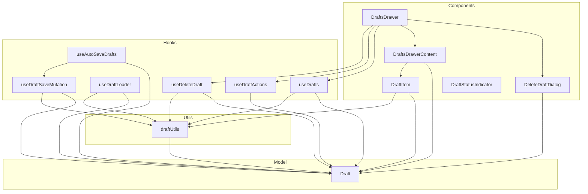
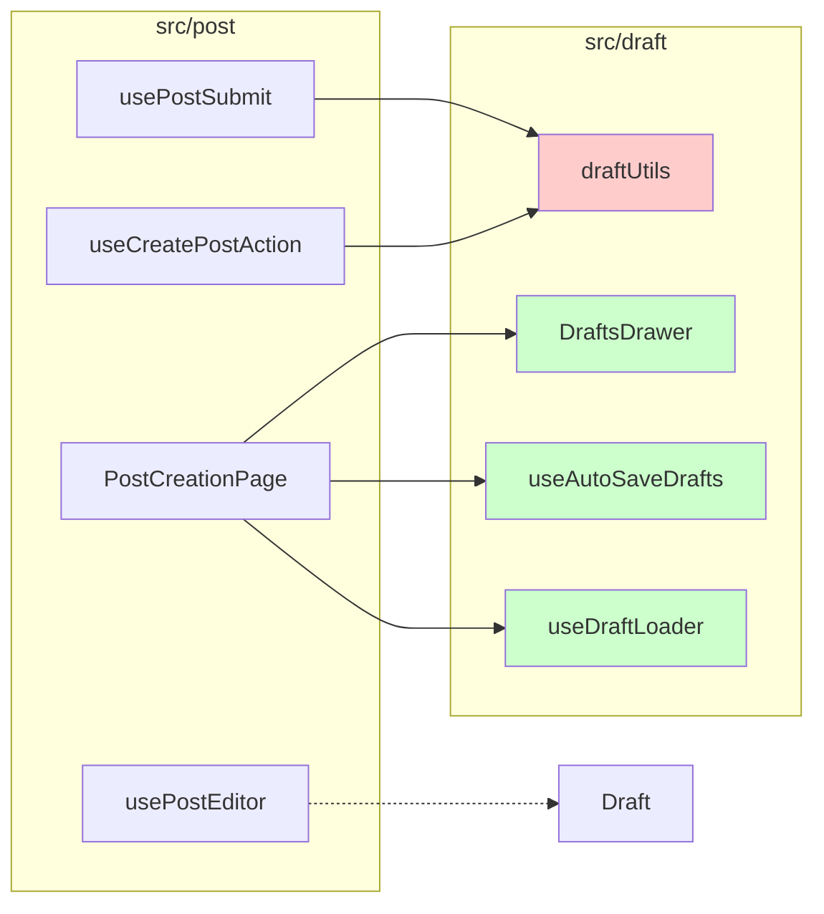

# REFACTORING ANALYSIS REPORT

**Generated**: 04-01-2026 14:11:10
**Target File(s)**: `src/draft/**/*` (Draft Feature)
**Analyst**: Claude Refactoring Specialist
**Report ID**: refactor_draft_04-01-2026_141110

---

## EXECUTIVE SUMMARY

The `src/draft` feature manages temporary draft saving functionality for the Daily Writing Friends application. This analysis identifies several refactoring opportunities to improve code organization, testability, and maintainability.

### Key Findings

| Category | Current State | Recommended Action |
|----------|--------------|-------------------|
| **Architecture** | API functions mixed with utilities | Separate into `api/` directory |
| **Test Coverage** | 11-37% (hooks/utils) | Increase to 80%+ |
| **Dead Code** | Empty `DraftSchema.ts`, unused hooks | Remove or consolidate |
| **Code Duplication** | `getDraftTitle` duplicated | Centralize in utility |
| **Overall Risk** | LOW | Safe to refactor incrementally |

### Refactoring Priority: **MEDIUM**
- Total lines: 1,057 (including tests)
- Files affected: 18
- External dependencies: 3 files in `src/post/`

---

## CODEBASE-WIDE CONTEXT

### Related Files Discovery

**Target feature imported by (3 external files)**:
| File | Import Type | Usage |
|------|-------------|-------|
| `src/post/hooks/usePostEditor.ts:2` | Type import | `Draft` interface |
| `src/post/hooks/usePostSubmit.ts:4` | Function import | `deleteDraft` |
| `src/post/hooks/useCreatePostAction.ts:3` | Function import | `deleteDraft` |
| `src/post/components/PostCreationPage.tsx:3,5,6` | Component/Hook imports | `DraftsDrawer`, `useAutoSaveDrafts`, `useDraftLoader` |

**Target feature dependencies**:
| Module | Usage |
|--------|-------|
| `@/firebase` | Firestore access |
| `@/shared/api/trackedFirebase` | Tracked Firebase operations |
| `@/shared/hooks/use-toast` | Toast notifications |
| `@/shared/utils/dateUtils` | Date formatting |
| `@/board/hooks/useBoardTitle` | Board title lookup |
| `@/comment/hooks/useDrawer` | Drawer state management |
| `@tanstack/react-query` | Data fetching |
| `react-router-dom` | Navigation |
| `react-simplikit` | useInterval hook |

**Circular dependencies detected**: None

### Additional Refactoring Candidates

| Priority | File | Lines | Reason |
|----------|------|-------|--------|
| MEDIUM | `src/post/components/PostCreationPage.tsx` | 157 | Heavy integration with draft hooks |
| LOW | `src/post/hooks/usePostSubmit.ts` | 77 | Contains draft deletion logic |
| LOW | `src/post/hooks/useCreatePostAction.ts` | 89 | Contains draft deletion logic |

### Recommended Approach
- **Refactoring Strategy**: Single-file modular refactoring
- **Rationale**: Draft feature is well-contained with minimal external coupling
- **Approach**: Extract API layer, consolidate utilities, remove dead code

---

## CURRENT STATE ANALYSIS

### File Inventory

| File | Lines | Purpose | Status |
|------|-------|---------|--------|
| **Model** ||||
| `model/Draft.ts` | 9 | Draft interface definition | ✅ Clean |
| `model/DraftSchema.ts` | 0 | Empty file | ❌ Dead code |
| **Utils** ||||
| `utils/draftUtils.ts` | 81 | API + utility functions mixed | ⚠️ Needs separation |
| `utils/draftUtils.test.ts` | 174 | Tests for utilities | ✅ Good coverage |
| **Hooks** ||||
| `hooks/useAutoSaveDrafts.ts` | 137 | Auto-save with interval | ⚠️ Complex, needs review |
| `hooks/useDeleteDraft.ts` | 82 | Delete with dialog state | ✅ Well-structured |
| `hooks/useDraftLoader.ts` | 69 | Load draft with React Query | ✅ Adequate |
| `hooks/useDraftSaveMutation.ts` | 44 | Save mutation | ✅ Clean |
| `hooks/useDraftActions.ts` | 35 | Navigation actions | ✅ Clean |
| `hooks/useDrafts.ts` | 25 | List drafts query | ✅ Clean |
| `hooks/useDebouncedAutoSave.ts` | 25 | Debounce hook | ⚠️ Potentially unused |
| `hooks/useIntervalAutoSave.ts` | 24 | Interval hook | ⚠️ Potentially unused |
| `hooks/usePreviousValue.ts` | 11 | Previous value ref | ⚠️ Duplicates functionality |
| `hooks/__tests__/useAutoSaveDraftsHelpers.test.ts` | 202 | Helper function tests | ✅ Good |
| **Components** ||||
| `components/DraftsDrawer.tsx` | 103 | Main drawer container | ✅ Well-composed |
| `components/DraftsDrawerContent.tsx` | 77 | Content with list | ✅ Clean |
| `components/DeleteDraftDialog.tsx` | 65 | Delete confirmation | ⚠️ Duplicates utility |
| `components/DraftItem.tsx` | 54 | Single draft item | ✅ Clean |
| `components/DraftStatusIndicator.tsx` | 42 | Status display | ✅ Clean |

### File Metrics Summary

| Metric | Value | Target | Status |
|--------|-------|--------|--------|
| Total Lines | 1,057 | - | - |
| Source Lines (excl. tests) | 681 | <500/feature | ⚠️ Moderate |
| Files | 18 | - | - |
| Hooks | 10 | <8 | ⚠️ Consider consolidation |
| Components | 5 | - | ✅ |
| Test Files | 2 | ≥3 | ⚠️ Need more |

### Code Smell Analysis

| Code Smell | Count | Severity | Examples |
|------------|-------|----------|----------|
| Mixed Responsibilities | 1 | HIGH | `draftUtils.ts` contains API + utilities |
| Dead Code | 1 | LOW | `DraftSchema.ts` is empty |
| Code Duplication | 1 | MEDIUM | `getDraftTitle` in `DeleteDraftDialog.tsx` |
| Potentially Unused Code | 3 | LOW | `useDebouncedAutoSave`, `useIntervalAutoSave`, `usePreviousValue` |
| Missing API Directory | 1 | MEDIUM | Violates project convention |

---

## TEST COVERAGE ANALYSIS

### Coverage Summary

| File/Module | Statement | Branch | Function | Lines | Status |
|-------------|-----------|--------|----------|-------|--------|
| `src/draft/hooks` | 0% | 11.11% | 11.11% | 0% | ❌ Critical gap |
| `src/draft/model` | 0% | 0% | 0% | 0% | ⚠️ Interface only |
| `src/draft/utils` | 37.7% | 88.88% | 42.85% | 37.7% | ⚠️ API untested |
| `src/draft/components` | 0% | 0% | 0% | 0% | ❌ No tests |

### Test File Mapping

| Source File | Test File | Coverage |
|-------------|-----------|----------|
| `draftUtils.ts` | `draftUtils.test.ts` | ✅ Partial (utilities only) |
| `useAutoSaveDrafts.ts` | `useAutoSaveDraftsHelpers.test.ts` | ✅ Helper functions only |
| All hooks | - | ❌ No integration tests |
| All components | - | ❌ No component tests |

### Existing Test Analysis

**`draftUtils.test.ts` (17 tests)**:
- ✅ Tests `formatDraftDate` function
- ✅ Tests `getDraftTitle` function
- ✅ Tests `getDraftPreview` function
- ❌ Does NOT test `saveDraft`, `getDrafts`, `getDraftById`, `deleteDraft` (API functions)

**`useAutoSaveDraftsHelpers.test.ts` (7 tests)**:
- ✅ Tests `useLatestValueRef` hook
- ✅ Tests `useConcurrentOperationGuard` hook
- ❌ Does NOT test the main `useAutoSaveDrafts` hook

### Coverage Gap Analysis

| Function/Component | Tested | Priority | Notes |
|--------------------|--------|----------|-------|
| `saveDraft()` | ❌ | HIGH | Core API function |
| `getDrafts()` | ❌ | HIGH | Core API function |
| `getDraftById()` | ❌ | MEDIUM | Used by loader |
| `deleteDraft()` | ❌ | HIGH | Used by 3 external files |
| `useAutoSaveDrafts` | ❌ | HIGH | Complex hook |
| `useDeleteDraft` | ❌ | MEDIUM | Contains business logic |
| `useDraftLoader` | ❌ | MEDIUM | Integration with React Query |
| `DraftsDrawer` | ❌ | LOW | Container component |
| `DraftItem` | ❌ | LOW | Presentation component |

### Safety Net Requirements

**Before Refactoring** (Tests WOULD BE needed):

1. **API Function Tests** (Priority: HIGH)
   - Mock Firebase/Firestore
   - Test `saveDraft` with new/existing draft scenarios
   - Test `getDrafts` with/without boardId filter
   - Test `getDraftById` success/not-found cases
   - Test `deleteDraft` success/error handling

2. **Hook Integration Tests** (Priority: HIGH)
   - Test `useAutoSaveDrafts` interval behavior
   - Test `useDeleteDraft` state management
   - Test `useDraftLoader` cache behavior

3. **Component Tests** (Priority: MEDIUM)
   - Test `DraftsDrawer` composition
   - Test `DraftItem` click/delete handlers
   - Test `DeleteDraftDialog` confirmation flow

---

## COMPLEXITY ANALYSIS

### Function-Level Metrics

| Function/Hook | Lines | Cyclomatic | Cognitive | Parameters | Nesting | Risk |
|---------------|-------|------------|-----------|------------|---------|------|
| `useAutoSaveDrafts` | 65 | 8 | 15 | 7 | 2 | MEDIUM |
| `useDeleteDraft` | 60 | 6 | 12 | 2 | 2 | LOW |
| `saveDraft` | 17 | 2 | 4 | 2 | 1 | LOW |
| `getDrafts` | 14 | 3 | 5 | 2 | 1 | LOW |
| `getDraftPreview` | 5 | 3 | 4 | 1 | 1 | LOW |
| `DraftsDrawer` | 45 | 2 | 6 | 3 | 1 | LOW |
| `DraftsDrawerContent` | 35 | 3 | 5 | 4 | 2 | LOW |

### Complexity Hotspots

| Rank | File | Function | Score | Reason |
|------|------|----------|-------|--------|
| 1 | `useAutoSaveDrafts.ts` | `useAutoSaveDrafts` | MEDIUM | 7 parameters, multiple refs, interval logic |
| 2 | `useDeleteDraft.ts` | `confirmDelete` | LOW | Error handling, cache invalidation |
| 3 | `useDraftLoader.ts` | `useDraftLoader` | LOW | Cache-first strategy with fallback |

### Dependency Analysis

**Internal Dependencies (within draft feature)**:



**External Coupling**:

| Module | Afferent (incoming) | Efferent (outgoing) | Instability |
|--------|---------------------|---------------------|-------------|
| `Draft` (model) | 11 | 1 | 0.08 (stable) |
| `draftUtils` | 6 | 3 | 0.33 (stable) |
| `useAutoSaveDrafts` | 1 | 2 | 0.67 |
| `useDraftLoader` | 1 | 2 | 0.67 |
| `DraftsDrawer` | 1 | 5 | 0.83 |

---

## REFACTORING STRATEGY

### Target Architecture

**Proposed Directory Structure**:

```
src/draft/
├── api/                          # NEW: Separate API layer
│   ├── draftApi.ts               # Firebase CRUD operations
│   └── draftApi.test.ts          # API tests with mocks
├── components/
│   ├── DraftsDrawer.tsx          # Keep as-is
│   ├── DraftsDrawerContent.tsx   # Keep as-is
│   ├── DraftItem.tsx             # Keep as-is
│   ├── DeleteDraftDialog.tsx     # Remove duplicate function
│   └── DraftStatusIndicator.tsx  # Keep as-is
├── hooks/
│   ├── useAutoSaveDrafts.ts      # Keep (well-tested helpers)
│   ├── useDeleteDraft.ts         # Keep as-is
│   ├── useDraftLoader.ts         # Keep as-is
│   ├── useDraftSaveMutation.ts   # Keep as-is
│   ├── useDraftActions.ts        # Keep as-is
│   ├── useDrafts.ts              # Keep as-is
│   ├── __tests__/
│   │   └── useAutoSaveDraftsHelpers.test.ts
│   └── [REMOVE: useDebouncedAutoSave.ts]
│   └── [REMOVE: useIntervalAutoSave.ts]
│   └── [REMOVE: usePreviousValue.ts]
├── model/
│   ├── Draft.ts                  # Keep as-is
│   └── [REMOVE: DraftSchema.ts]
└── utils/
    ├── draftFormatUtils.ts       # NEW: Only formatting utilities
    └── draftFormatUtils.test.ts  # Existing tests (renamed)
```

### Extraction Strategy

#### Extraction 1: Create API Layer
**Pattern**: Extract Module
**Risk**: LOW
**Lines affected**: ~55 lines from `draftUtils.ts`

**BEFORE** (`utils/draftUtils.ts`):
```typescript
// Mixed API and utility functions
import { doc, collection, getDoc, getDocs, query, where, orderBy, Timestamp } from 'firebase/firestore';
import { v4 as uuidv4 } from 'uuid';
import { firestore } from '@/firebase';
import { trackedFirebase } from '@/shared/api/trackedFirebase';
import { Draft } from '@/draft/model/Draft';

export async function saveDraft(draft: Omit<Draft, 'id' | 'savedAt'> & { id?: string }, userId: string): Promise<Draft> {
  // ... API logic
}

export async function getDrafts(userId: string, boardId?: string): Promise<Draft[]> {
  // ... API logic
}

// ... more API functions

// UI Utilities (should be separate)
export const formatDraftDate = (timestamp: any) => { /* ... */ };
export const getDraftTitle = (draft: Draft) => { /* ... */ };
export const getDraftPreview = (draft: Draft) => { /* ... */ };
```

**AFTER** (`api/draftApi.ts`):
```typescript
import { doc, collection, getDoc, getDocs, query, where, orderBy, Timestamp } from 'firebase/firestore';
import { v4 as uuidv4 } from 'uuid';
import { firestore } from '@/firebase';
import { trackedFirebase } from '@/shared/api/trackedFirebase';
import { Draft } from '@/draft/model/Draft';

export async function saveDraft(draft: Omit<Draft, 'id' | 'savedAt'> & { id?: string }, userId: string): Promise<Draft> {
  // ... API logic only
}

export async function getDrafts(userId: string, boardId?: string): Promise<Draft[]> {
  // ... API logic only
}

export async function getDraftById(userId: string, draftId: string): Promise<Draft | null> {
  // ... API logic only
}

export async function deleteDraft(userId: string, draftId: string): Promise<void> {
  // ... API logic only
}
```

**AFTER** (`utils/draftFormatUtils.ts`):
```typescript
import { Draft } from '@/draft/model/Draft';

export const formatDraftDate = (timestamp: any) => {
  const date = timestamp.toDate();
  return new Intl.DateTimeFormat(navigator.language || 'ko-KR', {
    year: 'numeric',
    month: '2-digit',
    day: '2-digit',
    hour: '2-digit',
    minute: '2-digit',
  }).format(date);
};

export const getDraftTitle = (draft: Draft) => {
  return draft.title.trim() ? draft.title : '(제목 없음)';
};

export const getDraftPreview = (draft: Draft) => {
  const plainText = draft.content.replace(/<[^>]*>/g, '');
  return plainText.length > 50
    ? plainText.substring(0, 50) + '...'
    : plainText || '(내용 없음)';
};
```

#### Extraction 2: Remove Code Duplication
**Pattern**: Remove duplication
**Risk**: LOW
**Lines affected**: ~5 lines

**BEFORE** (`components/DeleteDraftDialog.tsx`):
```typescript
export function DeleteDraftDialog({ /* ... */ }: DeleteDraftDialogProps) {
  // Duplicates draftUtils.getDraftTitle
  const getDraftTitle = () => {
    if (!draft) return '';
    return draft.title.trim() ? `"${draft.title}"` : '(제목 없음)';
  };
  // ...
}
```

**AFTER** (`components/DeleteDraftDialog.tsx`):
```typescript
import { getDraftTitle } from '@/draft/utils/draftFormatUtils';

export function DeleteDraftDialog({ /* ... */ }: DeleteDraftDialogProps) {
  const displayTitle = draft ? `"${getDraftTitle(draft)}"` : '';
  // ...
}
```

#### Extraction 3: Remove Dead Code
**Pattern**: Dead code removal
**Risk**: VERY LOW
**Files to remove**: 4

1. `model/DraftSchema.ts` - Empty file (0 lines)
2. `hooks/useDebouncedAutoSave.ts` - Unused (replaced by react-simplikit)
3. `hooks/useIntervalAutoSave.ts` - Unused (replaced by react-simplikit)
4. `hooks/usePreviousValue.ts` - Duplicate of `useLatestValueRef` in `useAutoSaveDrafts.ts`

**Verification Required**:
```bash
# Confirm no imports of these files
grep -r "useDebouncedAutoSave\|useIntervalAutoSave\|usePreviousValue\|DraftSchema" src/
```

---

## RISK ASSESSMENT

### Risk Matrix

| Risk | Likelihood | Impact | Score | Mitigation |
|------|------------|--------|-------|------------|
| Breaking API imports | LOW | MEDIUM | 3 | Update all 3 external consumers |
| Test regression | LOW | LOW | 2 | Existing tests cover utilities |
| Missing edge cases | MEDIUM | LOW | 3 | Add tests before refactoring |
| Performance degradation | VERY LOW | LOW | 1 | No logic changes |

### Technical Risks

**Risk 1**: Breaking imports in external files
- **Mitigation**: Re-export from `utils/draftUtils.ts` temporarily, then update consumers
- **Affected files**:
  - `src/post/hooks/usePostSubmit.ts`
  - `src/post/hooks/useCreatePostAction.ts`
  - `src/post/components/PostCreationPage.tsx`
- **Likelihood**: Low (simple path updates)
- **Impact**: Medium (3 files affected)

**Risk 2**: Removing actually-used hooks
- **Mitigation**: Verify with grep before deletion
- **Verification**: `grep -r "useDebouncedAutoSave\|useIntervalAutoSave\|usePreviousValue" src/`
- **Likelihood**: Very low
- **Impact**: Low (can easily restore)

### Rollback Strategy

1. **Git Safety**:
   - Create feature branch: `refactor/draft-structure`
   - Tag before refactoring: `pre-refactor-draft`
   - Commit after each extraction step

2. **Incremental Approach**:
   - Step 1: Create API layer (new files only)
   - Step 2: Update imports to new API (reversible)
   - Step 3: Remove old API code (after verification)
   - Step 4: Remove dead code (after grep verification)

---

## IMPLEMENTATION CHECKLIST

### TodoWrite Compatible Task List

```json
[
  {
    "id": "backup",
    "content": "Create backup of original files in backup_temp/ directory",
    "priority": "critical",
    "estimated_hours": 0.25
  },
  {
    "id": "verify_unused",
    "content": "Verify useDebouncedAutoSave, useIntervalAutoSave, usePreviousValue are unused",
    "priority": "high",
    "estimated_hours": 0.25
  },
  {
    "id": "create_api_dir",
    "content": "Create src/draft/api/ directory",
    "priority": "high",
    "estimated_hours": 0.1
  },
  {
    "id": "extract_api",
    "content": "Extract saveDraft, getDrafts, getDraftById, deleteDraft to api/draftApi.ts",
    "priority": "high",
    "estimated_hours": 0.5
  },
  {
    "id": "rename_utils",
    "content": "Rename draftUtils.ts to draftFormatUtils.ts and remove API exports",
    "priority": "high",
    "estimated_hours": 0.25
  },
  {
    "id": "update_internal_imports",
    "content": "Update 6 internal files to import from new locations",
    "priority": "high",
    "estimated_hours": 0.5
  },
  {
    "id": "update_external_imports",
    "content": "Update 3 external files (post feature) to import from api/draftApi",
    "priority": "high",
    "estimated_hours": 0.25
  },
  {
    "id": "remove_duplicate",
    "content": "Remove duplicate getDraftTitle from DeleteDraftDialog.tsx",
    "priority": "medium",
    "estimated_hours": 0.25
  },
  {
    "id": "remove_dead_code",
    "content": "Remove DraftSchema.ts, useDebouncedAutoSave.ts, useIntervalAutoSave.ts, usePreviousValue.ts",
    "priority": "medium",
    "estimated_hours": 0.25
  },
  {
    "id": "run_tests",
    "content": "Run npm run test:run and verify all tests pass",
    "priority": "high",
    "estimated_hours": 0.25
  },
  {
    "id": "run_typecheck",
    "content": "Run npm run type-check and verify no type errors",
    "priority": "high",
    "estimated_hours": 0.25
  },
  {
    "id": "update_test_imports",
    "content": "Update draftUtils.test.ts imports to match new file locations",
    "priority": "medium",
    "estimated_hours": 0.25
  }
]
```

### Phased Execution Plan

**Phase 1: Preparation (0.5 hours)**
- [ ] Create backup files in `backup_temp/`
- [ ] Verify unused hooks with grep
- [ ] Create feature branch

**Phase 2: API Extraction (1 hour)**
- [ ] Create `api/draftApi.ts` with API functions
- [ ] Rename `utils/draftUtils.ts` to `utils/draftFormatUtils.ts`
- [ ] Remove API functions from format utils
- [ ] Update all internal imports (6 files)
- [ ] Update all external imports (3 files)
- [ ] Run tests and type-check

**Phase 3: Cleanup (0.5 hours)**
- [ ] Remove duplicate `getDraftTitle` from `DeleteDraftDialog.tsx`
- [ ] Remove dead code files (4 files)
- [ ] Run final verification

**Phase 4: Documentation (0.25 hours)**
- [ ] Update imports in test files
- [ ] Verify all tests pass

---

## POST-REFACTORING DOCUMENTATION UPDATES

### Documentation Update Checklist

```markdown
- [ ] No README updates needed (internal refactoring)
- [ ] No AGENTS.md updates needed (follows existing conventions)
- [ ] Update any internal developer docs if they exist
- [ ] Verify import examples in any onboarding docs
```

### Commit Message Template

```
임시저장 기능 API 분리 리팩토링

- Extract API functions from draftUtils to api/draftApi
- Rename draftUtils.ts to draftFormatUtils.ts
- Remove duplicate getDraftTitle from DeleteDraftDialog
- Remove dead code: DraftSchema.ts, unused hooks

Files changed: 14 files
New modules: api/draftApi.ts
Removed: 4 files (dead code)
Backup location: backup_temp/draft_*
```

---

## SUCCESS METRICS

### Pre-Refactoring Baselines

| Metric | Current Value |
|--------|--------------|
| Files in feature | 18 |
| Total lines | 1,057 |
| Test coverage (hooks) | 11% |
| Test coverage (utils) | 37% |
| Dead code files | 4 |
| Code duplication instances | 1 |

### Post-Refactoring Targets

| Metric | Target | Priority |
|--------|--------|----------|
| Files in feature | 14 (-4) | ✅ |
| Total lines | ~980 | ✅ |
| API/Utils separation | 100% | ✅ |
| Dead code files | 0 | ✅ |
| Code duplication | 0 | ✅ |
| All tests passing | 100% | ✅ |
| Type-check passing | 100% | ✅ |

---

## APPENDICES

### A. Complete File Listing

```
src/draft/
├── components/
│   ├── DeleteDraftDialog.tsx    (65 lines)
│   ├── DraftItem.tsx            (54 lines)
│   ├── DraftStatusIndicator.tsx (42 lines)
│   ├── DraftsDrawer.tsx         (103 lines)
│   └── DraftsDrawerContent.tsx  (77 lines)
├── hooks/
│   ├── __tests__/
│   │   └── useAutoSaveDraftsHelpers.test.ts (202 lines)
│   ├── useAutoSaveDrafts.ts     (137 lines)
│   ├── useDebouncedAutoSave.ts  (25 lines) [TO REMOVE]
│   ├── useDeleteDraft.ts        (82 lines)
│   ├── useDraftActions.ts       (35 lines)
│   ├── useDraftLoader.ts        (69 lines)
│   ├── useDraftSaveMutation.ts  (44 lines)
│   ├── useDrafts.ts             (25 lines)
│   ├── useIntervalAutoSave.ts   (24 lines) [TO REMOVE]
│   └── usePreviousValue.ts      (11 lines) [TO REMOVE]
├── model/
│   ├── Draft.ts                 (9 lines)
│   └── DraftSchema.ts           (0 lines) [TO REMOVE]
└── utils/
    ├── draftUtils.test.ts       (174 lines)
    └── draftUtils.ts            (81 lines) [TO REFACTOR]
```

### B. External Dependencies Graph



### C. Import Update Guide

**Files requiring import updates after refactoring**:

| File | Current Import | New Import |
|------|----------------|------------|
| `hooks/useDrafts.ts` | `from '@/draft/utils/draftUtils'` | `from '@/draft/api/draftApi'` |
| `hooks/useDraftLoader.ts` | `from '@/draft/utils/draftUtils'` | `from '@/draft/api/draftApi'` |
| `hooks/useDraftSaveMutation.ts` | `from '@/draft/utils/draftUtils'` | `from '@/draft/api/draftApi'` |
| `hooks/useDeleteDraft.ts` | `from '@/draft/utils/draftUtils'` | `from '@/draft/api/draftApi'` |
| `components/DraftItem.tsx` | `from '@/draft/utils/draftUtils'` | `from '@/draft/utils/draftFormatUtils'` |
| `components/DeleteDraftDialog.tsx` | N/A | Add: `from '@/draft/utils/draftFormatUtils'` |
| `post/hooks/usePostSubmit.ts` | `from '@/draft/utils/draftUtils'` | `from '@/draft/api/draftApi'` |
| `post/hooks/useCreatePostAction.ts` | `from '@/draft/utils/draftUtils'` | `from '@/draft/api/draftApi'` |

---

*This report serves as a comprehensive guide for refactoring execution.*
*Reference this document when implementing: @reports/refactor/refactor_draft_04-01-2026_141110.md*
