# REFACTORING ANALYSIS REPORT
**Generated**: 04-01-2026 14:08:46
**Target**: `src/login` feature
**Analyst**: Claude Refactoring Specialist
**Report ID**: refactor_login_04-01-2026_140846

---

## EXECUTIVE SUMMARY

The `src/login` feature is a well-structured React feature module with 31 files totaling 1,737 lines of code. The module handles user authentication, cohort registration forms for both new and active users, and landing page components.

### Key Findings

| Category | Status | Details |
|----------|--------|---------|
| **Test Coverage** | ⚠️ CRITICAL | 0% - No test files exist |
| **Code Duplication** | ⚠️ CRITICAL | 100% duplicate `reviewUtils.ts` in two locations |
| **Complexity** | ⚠️ MODERATE | 6 files exceed 100 lines |
| **Type Safety** | ⚠️ MODERATE | `currentUser: any` type used |
| **Architecture** | ✅ GOOD | Clean feature-based structure |

### Recommended Priority

1. **CRITICAL**: Remove duplicate `reviewUtils.ts` (estimated 1 hour)
2. **HIGH**: Establish test baseline for form submission logic (estimated 2 days)
3. **HIGH**: Fix `JoinFormField` textarea bug (estimated 30 minutes)
4. **MEDIUM**: Extract shared form page logic (estimated 4 hours)
5. **LOW**: Fix cache key month calculation bug (estimated 15 minutes)

---

## CODEBASE-WIDE CONTEXT

### Target Feature Structure

```
src/login/
├── components/     # 21 files, 1,255 lines
├── hooks/          # 6 files, 192 lines
├── model/          # 2 files, 28 lines
├── utils/          # 1 file, 106 lines
└── data/           # 1 file, 39 lines
```

### External Dependencies

The login feature is **not imported by any other module** in the codebase. It serves as an entry point for user authentication and onboarding flows.

| Dependency Type | Modules Used |
|----------------|--------------|
| **Shared UI** | `@/shared/ui/*` (Button, Card, Input, Avatar, etc.) |
| **Shared Hooks** | `useAuth`, `useRemoteConfig` |
| **Shared Utils** | `boardUtils`, `reviewUtils`, `cn` |
| **User Module** | `updateUser`, `createUserIfNotExists`, `useUserNickname` |
| **Board Module** | `Board` model, `fetchBoardById` |
| **Firebase** | `signInWithGoogle`, `Timestamp`, Firestore operations |
| **External Libs** | react-hook-form, zod, react-query, sonner, lucide-react |

### Related Files for Multi-File Refactoring

| Priority | File | Lines | Reason |
|----------|------|-------|--------|
| CRITICAL | `src/shared/utils/reviewUtils.ts` | 106 | 100% duplicate of login/utils/reviewUtils.ts |
| HIGH | `src/login/components/JoinFormPageForActiveUser.tsx` | 140 | Share logic with JoinFormPageForNewUser |
| HIGH | `src/login/components/JoinFormPageForNewUser.tsx` | 144 | Share logic with JoinFormPageForActiveUser |
| MEDIUM | `src/login/components/JoinFormCardForActiveUser.tsx` | 155 | Extract form schema to constants |

### Recommended Approach

**Strategy**: Multi-file refactoring with phased approach
1. Phase 1: Eliminate duplicates (reviewUtils)
2. Phase 2: Establish test coverage
3. Phase 3: Extract shared patterns
4. Phase 4: Component simplification

---

## CURRENT STATE ANALYSIS

### File Metrics Summary Table

| Metric | Current | Target | Status |
|--------|---------|--------|--------|
| Total Lines | 1,737 | <2,000 | ✅ |
| Files > 100 lines | 6 | <3 | ⚠️ |
| Largest File | 155 lines | <120 | ⚠️ |
| Test Coverage | 0% | 80% | ❌ |
| Duplicate Files | 1 (106 lines) | 0 | ❌ |

### Detailed File Inventory

#### Components (21 files, 1,255 lines)

| File | Lines | Complexity | Notes |
|------|-------|------------|-------|
| `JoinFormCardForActiveUser.tsx` | 155 | HIGH | Inline Zod schema, 5 form fields |
| `JoinFormPageForNewUser.tsx` | 144 | MEDIUM | 2 helper functions, 4 hooks |
| `JoinFormPageForActiveUser.tsx` | 140 | MEDIUM | 2 helper functions, 4 hooks |
| `ActiveUserProfileList.tsx` | 123 | MEDIUM | Scroll state management |
| `JoinFormCardForNewUser.tsx` | 100 | MEDIUM | Inline Zod schema |
| `IntroCTA.tsx` | 79 | LOW | Clean conditional logic |
| `ReviewCarousel.tsx` | 79 | LOW | Embla carousel wrapper |
| `GoalSection.tsx` | 78 | LOW | Static content cards |
| `JoinIntroPage.tsx` | 69 | LOW | Composition of components |
| `JoinCompletePage.tsx` | 62 | LOW | Success confirmation |
| `LoginPage.tsx` | 59 | LOW | Google auth button |
| `CohortDetailsCard.tsx` | 53 | LOW | Static info display |
| `IntroContentSection.tsx` | 50 | LOW | Layout wrapper |
| `JoinFormField.tsx` | 41 | LOW | **BUG: textarea not implemented** |
| `JoinFormPageForActiveOrNewUser.tsx` | 35 | LOW | Router component |
| `CountdownSection.tsx` | 26 | LOW | Simple display |
| `IntroPageLayout.tsx` | 24 | LOW | Page wrapper |
| `showErrorToast.tsx` | 21 | LOW | Error utility |
| `IntroHero.tsx` | 15 | LOW | Image component |
| `JoinFormHeader.tsx` | 13 | LOW | Header component |
| `IntroHeader.tsx` | 6 | LOW | Title component |

#### Hooks (6 files, 192 lines)

| File | Lines | Dependencies | Notes |
|------|-------|--------------|-------|
| `useGoogleLoginWithRedirect.ts` | 60 | 5 hooks/functions | Side-effect management |
| `useUpcomingBoard.ts` | 53 | useQuery, useRemoteConfig | **BUG: month calculation** |
| `useActiveUser.ts` | 27 | useQuery, useRemoteConfig | Fetches active users |
| `useIsUserInWaitingList.ts` | 19 | useAuth, useUpcomingBoard | Derived state |
| `useDaysUntilCohortStart.ts` | 17 | useMemo | Date calculation |
| `useIsCurrentUserActive.ts` | 16 | useQuery, useRemoteConfig | Active status check |

#### Models (2 files, 28 lines)

| File | Lines | Exports | Description |
|------|-------|---------|-------------|
| `Review.ts` | 14 | 1 interface | Review data structure |
| `join.ts` | 14 | 2 interfaces | Form data types |

#### Utils (1 file, 106 lines)

| File | Lines | Exports | Status |
|------|-------|---------|--------|
| `reviewUtils.ts` | 106 | 4 functions | ❌ **100% DUPLICATE** |

#### Data (1 file, 39 lines)

| File | Lines | Description |
|------|-------|-------------|
| `testimonialReviews.ts` | 39 | 8 hardcoded testimonials |

---

## CODE SMELL ANALYSIS

### Critical Issues

#### 1. Duplicate reviewUtils.ts (CRITICAL)

**Location**:
- `src/login/utils/reviewUtils.ts` (106 lines)
- `src/shared/utils/reviewUtils.ts` (106 lines)

**Evidence**: Files are 100% identical (verified line-by-line)

**Impact**:
- Maintenance burden - changes must be made in two places
- Risk of divergence over time
- Confusion about which to import

**Resolution**:
```
1. Delete src/login/utils/reviewUtils.ts
2. Update any imports to use @/shared/utils/reviewUtils
3. Currently, JoinFormPageForActiveUser.tsx imports from @/shared (correct)
4. No files import from the local copy (safe to delete)
```

#### 2. Zero Test Coverage (CRITICAL)

**Evidence**: No test files found in `src/login/**/*test*.*`

**Impact**:
- No safety net for refactoring
- Regression risk with any changes
- Unknown behavior in edge cases

**Affected Areas**:
- Form submission logic (`submitActiveUserReview`, `submitNewUserJoin`)
- Hook behavior (`useGoogleLoginWithRedirect`, `useUpcomingBoard`)
- Component rendering states

### High Priority Issues

#### 3. JoinFormField Textarea Bug (HIGH)

**Location**: `src/login/components/JoinFormField.tsx:30-36`

**Evidence**:
```tsx
// FormFieldProps accepts type="textarea"
type: string  // can be "textarea"

// But renders only Input component
<Input
  id={id}
  type={type}  // textarea passed here doesn't work!
  ...
/>
```

**Usage**: `JoinFormCardForActiveUser.tsx` passes `type="textarea"` for keep/problem/try fields

**Impact**: Textarea fields render as single-line inputs

**Resolution**:
```tsx
// Option 1: Conditionally render
{type === 'textarea' ? (
  <Textarea {...register(id)} placeholder={placeholder} />
) : (
  <Input type={type} {...register(id)} placeholder={placeholder} />
)}

// Option 2: Use separate TextareaField component
```

#### 4. Type Safety: `currentUser: any` (HIGH)

**Location**: `src/login/components/JoinFormPageForNewUser.tsx:86`

```typescript
export async function submitNewUserJoin(params: {
    data: JoinFormDataForNewUser;
    upcomingBoard: Board;
    currentUser: any;  // ← Should use User type
}): Promise<...>
```

**Impact**: No type checking for currentUser properties

**Resolution**: Import and use `User` type from `@/user/model/User`

### Medium Priority Issues

#### 5. Duplicate Form Page Logic (MEDIUM)

**Location**:
- `JoinFormPageForActiveUser.tsx` (140 lines)
- `JoinFormPageForNewUser.tsx` (144 lines)

**Duplicated Patterns**:
```typescript
// Both files have nearly identical:
1. State management (isComplete, completeInfo)
2. Loading state composition
3. shouldShowCompletePage logic
4. Page layout structure
5. titleAndSubtitle helper function pattern
```

**Estimated Duplication**: ~70% of code structure

**Resolution**: Extract shared logic to custom hook:
```typescript
// Proposed: useJoinFormPage hook
function useJoinFormPage() {
  const { currentUser } = useAuth();
  const { data: upcomingBoard, isLoading: isBoardLoading } = useUpcomingBoard();
  const { isInWaitingList, isLoading: isCheckingWaitingList } = useIsUserInWaitingList();
  const [isComplete, setIsComplete] = useState(false);
  const [completeInfo, setCompleteInfo] = useState<{name: string, cohort: number} | null>(null);

  // ... shared logic

  return { isLoading, shouldShowCompletePage, ... };
}
```

#### 6. Inline Zod Schemas (MEDIUM)

**Location**:
- `JoinFormCardForActiveUser.tsx:14-20`
- `JoinFormCardForNewUser.tsx` (similar)

**Issue**: Form validation schemas defined inside components

**Impact**:
- Cannot reuse schemas for testing
- Harder to maintain validation rules
- Schema not visible at module level

**Resolution**: Move to `src/login/model/formSchemas.ts`:
```typescript
export const activeUserFormSchema = z.object({
  keep: z.string().optional(),
  problem: z.string().optional(),
  try: z.string().optional(),
  nps: z.number().min(1).max(10),
  willContinue: z.enum(["yes", "no"]),
});

export const newUserFormSchema = z.object({
  name: z.string().min(1),
  nickname: z.string().min(1),
  phoneNumber: z.string().optional(),
  referrer: z.string().optional(),
});
```

### Low Priority Issues

#### 7. Cache Key Month Bug (LOW)

**Location**: `src/login/hooks/useUpcomingBoard.ts:19-22`

```typescript
const getYearMonth = (): string => {
    const now = new Date();
    return `${now.getFullYear()}-${now.getMonth()}`; // Returns 0-11, not 1-12!
};
```

**Impact**:
- January returns "2026-0" instead of "2026-01"
- Works but inconsistent with expectations

**Resolution**:
```typescript
return `${now.getFullYear()}-${String(now.getMonth() + 1).padStart(2, '0')}`;
```

#### 8. Hardcoded Remote Config Keys (LOW)

**Locations**:
- `useUpcomingBoard.ts`: `'upcoming_board_id'`
- `useActiveUser.ts`: `'active_board_id'`
- `useIsCurrentUserActive.ts`: `'active_board_id'`

**Resolution**: Create constants file:
```typescript
// src/login/constants.ts
export const REMOTE_CONFIG_KEYS = {
  UPCOMING_BOARD_ID: 'upcoming_board_id',
  ACTIVE_BOARD_ID: 'active_board_id',
} as const;
```

#### 9. Magic Numbers (LOW)

**Locations**:
- `ActiveUserProfileList.tsx:58`: `scrollAmount = 200`
- `useUpcomingBoard.ts:48-49`: `staleTime: 1000 * 60 * 60`

**Resolution**: Extract to named constants with comments

---

## TEST COVERAGE ANALYSIS

### Current State

| Category | Coverage | Test Files | Notes |
|----------|----------|-----------|-------|
| Components | 0% | 0 | No component tests |
| Hooks | 0% | 0 | No hook tests |
| Utils | 0% | 0 | No utility tests |
| Models | N/A | 0 | Type-only files |

### Critical Testing Gaps

#### 1. Form Submission Functions (CRITICAL)

**Functions requiring tests**:
- `submitActiveUserReview` (JoinFormPageForActiveUser.tsx:84-127)
- `submitNewUserJoin` (JoinFormPageForNewUser.tsx:83-130)

**Test cases needed**:
```typescript
describe('submitActiveUserReview', () => {
  describe('when required params are valid', () => {
    it('creates review and adds user to waiting list');
    it('returns success with user info');
  });

  describe('when boardId is missing', () => {
    it('returns error with descriptive message');
  });

  describe('when userId is missing', () => {
    it('returns error with descriptive message');
  });

  describe('when addReviewToBoard fails', () => {
    it('returns error and does not add to waiting list');
  });

  describe('when addUserToBoardWaitingList fails', () => {
    it('returns error after review is created');
  });
});
```

#### 2. Hooks with Side Effects (HIGH)

**Hooks requiring tests**:
- `useGoogleLoginWithRedirect` - Complex navigation logic
- `useUpcomingBoard` - React Query integration
- `useIsUserInWaitingList` - Derived state

**Test approach**:
```typescript
// Use @testing-library/react-hooks or renderHook from @testing-library/react
describe('useGoogleLoginWithRedirect', () => {
  describe('when login succeeds', () => {
    describe('when user is active', () => {
      it('navigates to /boards');
    });

    describe('when user is not active', () => {
      it('navigates to /join/form');
    });
  });

  describe('when login fails', () => {
    it('sets error state');
    it('sets isLoading to false');
  });
});
```

### Test Coverage Target

| Component | Target Coverage | Priority |
|-----------|-----------------|----------|
| submitActiveUserReview | 100% | CRITICAL |
| submitNewUserJoin | 100% | CRITICAL |
| useGoogleLoginWithRedirect | 90% | HIGH |
| useUpcomingBoard | 80% | HIGH |
| JoinFormCardForActiveUser | 80% | MEDIUM |
| JoinFormCardForNewUser | 80% | MEDIUM |

### Testing Environment

**Framework**: Vitest (configured in project)
**Commands**:
```bash
# Run tests
npm run test:run

# Run with coverage
npm run test:coverage

# Watch mode
npm run test
```

---

## COMPLEXITY ANALYSIS

### Function-Level Complexity Metrics

| Function/Component | Lines | Cyclomatic | Parameters | Nesting | Risk |
|-------------------|-------|------------|------------|---------|------|
| `submitNewUserJoin` | 47 | 8 | 3 (object) | 2 | MEDIUM |
| `submitActiveUserReview` | 43 | 7 | 4 (object) | 2 | MEDIUM |
| `ActiveUserProfileList` | 123 | 6 | 2 | 3 | MEDIUM |
| `JoinFormCardForActiveUser` | 155 | 5 | 2 | 2 | MEDIUM |
| `useGoogleLoginWithRedirect` | 60 | 5 | 0 | 2 | MEDIUM |
| `checkScrollability` | 10 | 3 | 0 | 1 | LOW |
| `handleSubmit` (pages) | 20 | 3 | 1 | 1 | LOW |
| `titleAndSubtitle` | 8 | 2 | 1 | 0 | LOW |

### Complexity Hotspots

#### 1. JoinFormCardForActiveUser.tsx (155 lines)

**Breakdown**:
- Schema definition: 7 lines
- Interface: 4 lines
- Form setup: 14 lines
- JSX template: 130 lines (mostly form fields)

**Recommendation**: Component size is acceptable due to form field rendering. Consider extracting form schema to separate file.

#### 2. ActiveUserProfileList.tsx (123 lines)

**Breakdown**:
- Scroll state management: 30 lines
- Event handlers: 20 lines
- JSX template: 60 lines

**Recommendation**: Consider using CSS scroll-snap for native scrolling, or extract scroll logic to custom hook.

---

## DEPENDENCY ANALYSIS

### Dependency Graph (Mermaid)

```mermaid
graph TD
    subgraph "Login Feature"
        LP[LoginPage]
        JIP[JoinIntroPage]
        JFPA[JoinFormPageForActiveUser]
        JFPN[JoinFormPageForNewUser]
        JFPAO[JoinFormPageForActiveOrNewUser]
        JCP[JoinCompletePage]

        JFCA[JoinFormCardForActiveUser]
        JFCN[JoinFormCardForNewUser]
        JFF[JoinFormField]

        ICTA[IntroCTA]
        AUPL[ActiveUserProfileList]
        RC[ReviewCarousel]

        UAU[useActiveUser]
        UUB[useUpcomingBoard]
        UGLR[useGoogleLoginWithRedirect]
        UIUWL[useIsUserInWaitingList]
        UICUA[useIsCurrentUserActive]
        UDUCS[useDaysUntilCohortStart]

        RU[reviewUtils]
    end

    subgraph "Shared"
        useAuth
        useRemoteConfig
        boardUtils
        sharedReviewUtils[reviewUtils - DUPLICATE]
    end

    subgraph "User Module"
        updateUser
        createUserIfNotExists
        useUserNickname
    end

    JIP --> UAU
    JIP --> UUB
    JIP --> UGLR
    JIP --> UIUWL
    JIP --> UDUCS
    JIP --> ICTA
    JIP --> AUPL
    JIP --> RC

    JFPA --> UUB
    JFPA --> UIUWL
    JFPA --> useAuth
    JFPA --> sharedReviewUtils
    JFPA --> JFCA

    JFPN --> UUB
    JFPN --> UIUWL
    JFPN --> useAuth
    JFPN --> updateUser
    JFPN --> createUserIfNotExists
    JFPN --> JFCN

    JFPAO --> UICUA

    UGLR --> useAuth
    UGLR --> UICUA

    UUB --> useRemoteConfig
    UUB --> boardUtils

    UAU --> useRemoteConfig

    UIUWL --> useAuth
    UIUWL --> UUB

    JFCA --> JFF
    JFCN --> JFF

    RU -.->|DUPLICATE| sharedReviewUtils

    style RU fill:#ff9999
    style sharedReviewUtils fill:#ff9999
```



### Coupling Metrics

| Module | Afferent (incoming) | Efferent (outgoing) | Instability |
|--------|---------------------|---------------------|-------------|
| JoinIntroPage | 0 | 8 | 1.0 |
| useUpcomingBoard | 3 | 2 | 0.4 |
| useAuth (shared) | 6 | 0 | 0.0 |
| boardUtils (shared) | 3 | 0 | 0.0 |

### Circular Dependencies

**None detected** - The dependency graph is acyclic.

---

## REFACTORING PLAN

### Phase 1: Critical Fixes (Day 1)

#### Task 1.1: Remove Duplicate reviewUtils

| Step | Action | Verification |
|------|--------|--------------|
| 1 | Verify no imports from `@/login/utils/reviewUtils` | `grep -r "@/login/utils/reviewUtils"` |
| 2 | Delete `src/login/utils/reviewUtils.ts` | File removed |
| 3 | Run type-check | `npm run type-check` passes |
| 4 | Run build | `npm run build` succeeds |

**Estimated time**: 30 minutes

#### Task 1.2: Fix JoinFormField Textarea Bug

| Step | Action |
|------|--------|
| 1 | Import Textarea component |
| 2 | Add conditional rendering for textarea type |
| 3 | Test both Input and Textarea variants |

**Code change**:
```tsx
// JoinFormField.tsx
import { Input } from "@/shared/ui/input"
import { Textarea } from "@/shared/ui/textarea"

// In render:
{type === 'textarea' ? (
  <Textarea
    id={id}
    {...register(id)}
    placeholder={placeholder}
    className="min-h-[100px] rounded-md text-base transition-all focus-visible:ring-slate-400"
  />
) : (
  <Input
    id={id}
    type={type}
    inputMode={inputMode}
    {...register(id)}
    placeholder={placeholder}
    className="h-12 rounded-md text-base transition-all focus-visible:ring-slate-400 lg:h-14"
  />
)}
```

**Estimated time**: 30 minutes

#### Task 1.3: Fix Type Safety

| Step | Action |
|------|--------|
| 1 | Import User type in JoinFormPageForNewUser |
| 2 | Update submitNewUserJoin parameter type |
| 3 | Run type-check to verify |

**Estimated time**: 15 minutes

### Phase 2: Test Coverage (Days 2-3)

#### Task 2.1: Test Form Submission Functions

**File**: `src/login/components/__tests__/JoinFormPage.test.ts`

| Test Suite | Test Cases | Priority |
|------------|------------|----------|
| submitActiveUserReview | 5 cases | CRITICAL |
| submitNewUserJoin | 5 cases | CRITICAL |

**Estimated time**: 4 hours

#### Task 2.2: Test Hooks

**File**: `src/login/hooks/__tests__/useGoogleLoginWithRedirect.test.ts`

| Test Suite | Test Cases | Priority |
|------------|------------|----------|
| useGoogleLoginWithRedirect | 4 cases | HIGH |
| useUpcomingBoard | 3 cases | HIGH |
| useIsUserInWaitingList | 2 cases | MEDIUM |

**Estimated time**: 4 hours

### Phase 3: Code Consolidation (Days 4-5)

#### Task 3.1: Extract Form Schemas

**New file**: `src/login/model/formSchemas.ts`

```typescript
import { z } from 'zod';

export const activeUserFormSchema = z.object({
  keep: z.string().optional(),
  problem: z.string().optional(),
  try: z.string().optional(),
  nps: z.number().min(1).max(10),
  willContinue: z.enum(["yes", "no"]),
});

export const newUserFormSchema = z.object({
  name: z.string().min(1, "이름을 입력해주세요"),
  nickname: z.string().min(1, "닉네임을 입력해주세요"),
  phoneNumber: z.string().optional(),
  referrer: z.string().optional(),
});

export type ActiveUserFormData = z.infer<typeof activeUserFormSchema>;
export type NewUserFormData = z.infer<typeof newUserFormSchema>;
```

**Estimated time**: 1 hour

#### Task 3.2: Extract Shared Form Page Logic

**New file**: `src/login/hooks/useJoinFormPage.ts`

```typescript
interface UseJoinFormPageOptions {
  onSubmitSuccess: (name: string, cohort: number) => void;
}

interface UseJoinFormPageReturn {
  currentUser: User | null;
  upcomingBoard: Board | null;
  isLoading: boolean;
  isInWaitingList: boolean;
  shouldShowCompletePage: boolean;
  completeInfo: { name: string; cohort: number } | null;
  setComplete: (info: { name: string; cohort: number }) => void;
}

export function useJoinFormPage(): UseJoinFormPageReturn {
  // Shared logic extracted from both form pages
}
```

**Estimated time**: 3 hours

#### Task 3.3: Create Constants File

**New file**: `src/login/constants.ts`

```typescript
export const REMOTE_CONFIG_KEYS = {
  UPCOMING_BOARD_ID: 'upcoming_board_id',
  ACTIVE_BOARD_ID: 'active_board_id',
} as const;

export const ROUTES = {
  BOARDS: '/boards',
  JOIN_FORM: '/join/form',
} as const;

export const UI_CONSTANTS = {
  SCROLL_AMOUNT: 200,
  CACHE_STALE_TIME: 1000 * 60 * 60, // 1 hour
  CACHE_TIME: 1000 * 60 * 60 * 24, // 24 hours
} as const;
```

**Estimated time**: 30 minutes

### Phase 4: Component Refinement (Day 6)

#### Task 4.1: Fix Cache Key Bug

```typescript
// useUpcomingBoard.ts:19-22
const getYearMonth = (): string => {
    const now = new Date();
    return `${now.getFullYear()}-${String(now.getMonth() + 1).padStart(2, '0')}`;
};
```

**Estimated time**: 15 minutes

#### Task 4.2: Refactor ActiveUserProfileList Scroll

Consider replacing manual scroll detection with CSS scroll-snap or extracting to `useHorizontalScroll` hook.

**Estimated time**: 2 hours

---

## RISK ASSESSMENT

### Risk Matrix

| Risk | Likelihood | Impact | Score | Mitigation |
|------|------------|--------|-------|------------|
| Breaking form submission | Medium | Critical | 8 | Write tests BEFORE refactoring |
| Regression in auth flow | Low | Critical | 6 | Test login redirect paths |
| UI rendering issues | Low | Medium | 3 | Visual testing after textarea fix |
| Cache invalidation issues | Low | Low | 2 | Monitor after month bug fix |

### Technical Risks

#### Risk 1: Form Submission Regression

- **Likelihood**: Medium (no tests currently)
- **Impact**: Critical (users cannot register)
- **Mitigation**:
  1. Write comprehensive tests for `submitActiveUserReview` and `submitNewUserJoin`
  2. Test on staging environment before production
  3. Monitor Sentry for new errors after deployment

#### Risk 2: Authentication Flow Regression

- **Likelihood**: Low (code is stable)
- **Impact**: Critical (users cannot login)
- **Mitigation**:
  1. Test Google login flow manually
  2. Verify redirect paths work correctly
  3. Test both active and new user scenarios

### Rollback Strategy

1. **Git Branch Protection**: Create feature branch for refactoring
2. **Incremental Commits**: Commit after each phase
3. **Staging Deploy**: Test on staging before production
4. **Quick Rollback**: Keep main branch stable for emergency revert

---

## IMPLEMENTATION CHECKLIST

```json
[
  {"id": "1.1", "content": "Delete duplicate src/login/utils/reviewUtils.ts", "priority": "critical", "status": "pending"},
  {"id": "1.2", "content": "Fix JoinFormField textarea rendering bug", "priority": "critical", "status": "pending"},
  {"id": "1.3", "content": "Fix currentUser type safety in submitNewUserJoin", "priority": "high", "status": "pending"},
  {"id": "2.1", "content": "Write tests for submitActiveUserReview function", "priority": "critical", "status": "pending"},
  {"id": "2.2", "content": "Write tests for submitNewUserJoin function", "priority": "critical", "status": "pending"},
  {"id": "2.3", "content": "Write tests for useGoogleLoginWithRedirect hook", "priority": "high", "status": "pending"},
  {"id": "2.4", "content": "Write tests for useUpcomingBoard hook", "priority": "high", "status": "pending"},
  {"id": "3.1", "content": "Extract form schemas to src/login/model/formSchemas.ts", "priority": "medium", "status": "pending"},
  {"id": "3.2", "content": "Create useJoinFormPage hook to share form page logic", "priority": "medium", "status": "pending"},
  {"id": "3.3", "content": "Create src/login/constants.ts for config keys and magic numbers", "priority": "low", "status": "pending"},
  {"id": "4.1", "content": "Fix getYearMonth cache key month calculation", "priority": "low", "status": "pending"},
  {"id": "4.2", "content": "Consider scroll-snap for ActiveUserProfileList", "priority": "low", "status": "pending"}
]
```

---

## SUCCESS METRICS

### Pre-Refactoring Baselines

| Metric | Current Value |
|--------|---------------|
| Test Coverage | 0% |
| Total Lines | 1,737 |
| Files > 100 lines | 6 |
| Duplicate Files | 1 |
| Type Errors | 0 (passes type-check) |
| Build Status | ✅ Passing |

### Post-Refactoring Targets

| Metric | Target | Verification |
|--------|--------|--------------|
| Test Coverage | ≥ 80% | `npm run test:coverage` |
| Duplicate Files | 0 | Manual verification |
| Type Safety Issues | 0 | `npm run type-check` |
| Build Status | ✅ | `npm run build` |
| Form Submissions | Working | Manual E2E test |
| Authentication Flow | Working | Manual E2E test |

---

## APPENDICES

### A. Full File List with Line Counts

```
src/login/
├── components/
│   ├── IntroHeader.tsx                    (6 lines)
│   ├── JoinFormHeader.tsx                 (13 lines)
│   ├── IntroHero.tsx                      (15 lines)
│   ├── showErrorToast.tsx                 (21 lines)
│   ├── IntroPageLayout.tsx                (24 lines)
│   ├── CountdownSection.tsx               (26 lines)
│   ├── JoinFormPageForActiveOrNewUser.tsx (35 lines)
│   ├── JoinFormField.tsx                  (41 lines)
│   ├── IntroContentSection.tsx            (50 lines)
│   ├── CohortDetailsCard.tsx              (53 lines)
│   ├── LoginPage.tsx                      (59 lines)
│   ├── JoinCompletePage.tsx               (62 lines)
│   ├── JoinIntroPage.tsx                  (69 lines)
│   ├── GoalSection.tsx                    (78 lines)
│   ├── IntroCTA.tsx                       (79 lines)
│   ├── ReviewCarousel.tsx                 (79 lines)
│   ├── JoinFormCardForNewUser.tsx         (100 lines)
│   ├── ActiveUserProfileList.tsx          (123 lines)
│   ├── JoinFormPageForActiveUser.tsx      (140 lines)
│   ├── JoinFormPageForNewUser.tsx         (144 lines)
│   └── JoinFormCardForActiveUser.tsx      (155 lines)
├── hooks/
│   ├── useIsCurrentUserActive.ts          (16 lines)
│   ├── useDaysUntilCohortStart.ts         (17 lines)
│   ├── useIsUserInWaitingList.ts          (19 lines)
│   ├── useActiveUser.ts                   (27 lines)
│   ├── useUpcomingBoard.ts                (53 lines)
│   └── useGoogleLoginWithRedirect.ts      (60 lines)
├── model/
│   ├── Review.ts                          (14 lines)
│   └── join.ts                            (14 lines)
├── utils/
│   └── reviewUtils.ts                     (106 lines) [DUPLICATE - DELETE]
└── data/
    └── testimonialReviews.ts              (39 lines)

TOTAL: 1,737 lines across 31 files
```

### B. Import Dependency Map

```
JoinFormPageForActiveUser.tsx imports:
  - react (useState)
  - sonner (toast)
  - @/board/model/Board
  - @/login/components/showErrorToast
  - @/login/hooks/useUpcomingBoard
  - @/login/hooks/useIsUserInWaitingList
  - @/login/model/join
  - @/shared/hooks/useAuth
  - @/shared/utils/boardUtils
  - @/shared/utils/reviewUtils ← CORRECT (uses shared)
  - @/user/hooks/useUserNickname
  - ./JoinCompletePage
  - ./JoinFormCardForActiveUser
  - ./JoinFormHeader

JoinFormPageForNewUser.tsx imports:
  - react (useState)
  - sonner (toast)
  - @/board/model/Board
  - @/login/components/showErrorToast
  - @/login/hooks/useUpcomingBoard
  - @/login/hooks/useIsUserInWaitingList
  - @/login/model/join
  - @/shared/hooks/useAuth
  - @/shared/utils/boardUtils
  - @/user/api/user
  - @/user/hooks/useUserNickname
  - ./JoinCompletePage
  - ./JoinFormCardForNewUser
  - ./JoinFormHeader
```

### C. Proposed File Structure After Refactoring

```
src/login/
├── components/
│   ├── forms/
│   │   ├── JoinFormField.tsx           (enhanced with textarea)
│   │   ├── JoinFormCardForActiveUser.tsx
│   │   └── JoinFormCardForNewUser.tsx
│   ├── intro/
│   │   ├── IntroHeader.tsx
│   │   ├── IntroHero.tsx
│   │   ├── IntroCTA.tsx
│   │   ├── IntroPageLayout.tsx
│   │   ├── IntroContentSection.tsx
│   │   ├── GoalSection.tsx
│   │   ├── ReviewCarousel.tsx
│   │   ├── CountdownSection.tsx
│   │   ├── CohortDetailsCard.tsx
│   │   └── ActiveUserProfileList.tsx
│   ├── pages/
│   │   ├── LoginPage.tsx
│   │   ├── JoinIntroPage.tsx
│   │   ├── JoinFormPageForActiveUser.tsx
│   │   ├── JoinFormPageForNewUser.tsx
│   │   ├── JoinFormPageForActiveOrNewUser.tsx
│   │   └── JoinCompletePage.tsx
│   └── shared/
│       ├── JoinFormHeader.tsx
│       └── showErrorToast.tsx
├── hooks/
│   ├── useActiveUser.ts
│   ├── useDaysUntilCohortStart.ts
│   ├── useGoogleLoginWithRedirect.ts
│   ├── useIsCurrentUserActive.ts
│   ├── useIsUserInWaitingList.ts
│   ├── useJoinFormPage.ts              (NEW - shared logic)
│   └── useUpcomingBoard.ts
├── model/
│   ├── Review.ts
│   ├── join.ts
│   └── formSchemas.ts                  (NEW - extracted schemas)
├── data/
│   └── testimonialReviews.ts
├── constants.ts                        (NEW - config keys, routes)
└── __tests__/                          (NEW - test directory)
    ├── submitActiveUserReview.test.ts
    ├── submitNewUserJoin.test.ts
    └── hooks/
        ├── useGoogleLoginWithRedirect.test.ts
        └── useUpcomingBoard.test.ts
```

---

## POST-REFACTORING DOCUMENTATION UPDATES

After successful refactoring, update:

1. ~~**README.md**~~ - No changes needed (login feature not referenced)
2. ~~**AGENTS.md**~~ - No changes needed (general patterns unchanged)
3. **Internal notes** - Document the duplicate removal for team awareness

---

*This report serves as a comprehensive guide for refactoring execution.*
*Reference this document when implementing: `@reports/refactor/refactor_login_04-01-2026_140846.md`*
