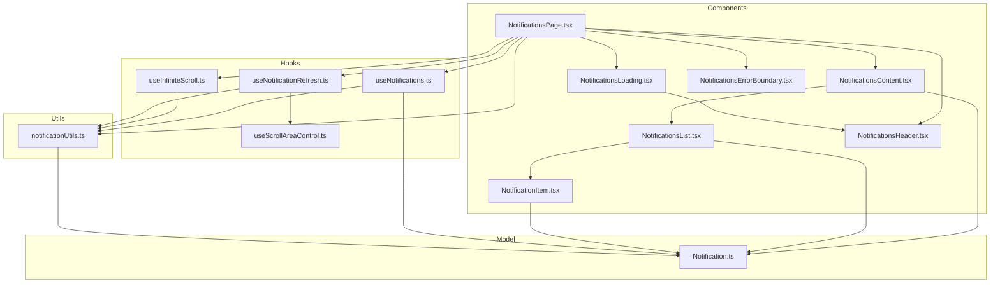

# REFACTORING ANALYSIS REPORT

**Generated**: 04-01-2026 14:35:00
**Target Feature**: `src/notification`
**Analyst**: Claude Refactoring Specialist
**Report ID**: refactor_notification_04-01-2026_143500

---

## EXECUTIVE SUMMARY

The `src/notification` feature is a well-structured, relatively small module (607 lines of source code across 14 files) that handles user notification display with infinite scrolling. The codebase demonstrates good separation of concerns and adheres to the project's feature-based architecture.

**Key Findings:**
- ✅ All files are under 100 lines - excellent modularity
- ✅ Clean separation between components, hooks, models, and utilities
- ⚠️ Only 1 test file exists - significant test coverage gap
- ⚠️ 2 hooks (`useInfiniteScroll`, `useScrollAreaControl`) are reusable and should be moved to shared
- ❌ Empty `NotificationSchema.ts` file - dead code
- ⚠️ No dedicated API layer - Firebase calls embedded in hooks

**Overall Health Score**: 7/10 - Well-organized but needs test coverage and minor structural improvements.

**Recommended Approach**: **Single-file focused refactoring** - This module is relatively healthy. Focus on incremental improvements rather than major restructuring.

---

## CODEBASE-WIDE CONTEXT

### Related Files Discovery

- **Target module imported by**: 2 external files
  - `src/router.tsx` - Imports `NotificationsPage` for routing
  - `src/user/components/UserPostList.tsx` - Imports `useInfiniteScroll` hook

- **Target module imports from**:
  - `@/firebase` - Firebase configuration
  - `@/shared/components/StatusMessage` - Shared UI component
  - `@/shared/contexts/BottomTabHandlerContext` - Tab navigation context
  - `@/shared/hooks/useAuth` - Authentication hook
  - `@/shared/hooks/usePerformanceMonitoring` - Performance monitoring
  - `@/shared/ui/*` - Multiple shared UI components (Button, Card, Avatar, ScrollArea, Skeleton)
  - `@tanstack/react-query` - Data fetching library
  - `@sentry/react` - Error tracking
  - `firebase/firestore` - Database operations
  - `lucide-react` - Icons
  - `react-router-dom` - Navigation

- **Tightly coupled modules**: None significant
- **Circular dependencies detected**: No

### Cross-Feature Dependencies

| File | External Usage | Concern |
|------|----------------|---------|
| `useInfiniteScroll.ts` | Used by `@user/components/UserPostList.tsx` | Should be in `@shared/hooks` |
| `useScrollAreaControl.ts` | Only used internally but generic enough | Could be in `@shared/hooks` |

### Recommended Approach

- **Refactoring Strategy**: single-file focused improvements
- **Rationale**: The module is already well-organized. Focus on moving reusable hooks to shared, adding tests, and cleaning up dead code.
- **Additional files to include**: None required

---

## CURRENT STATE ANALYSIS

### File Structure Overview

```
src/notification/
├── components/
│   ├── NotificationsPage.tsx      (96 lines) - Main page orchestrator
│   ├── NotificationsContent.tsx   (43 lines) - Content container with scroll
│   ├── NotificationsList.tsx      (30 lines) - List renderer
│   ├── NotificationItem.tsx       (36 lines) - Individual notification item
│   ├── NotificationsHeader.tsx    (18 lines) - Page header
│   ├── NotificationsLoading.tsx   (35 lines) - Loading skeleton state
│   └── NotificationsErrorBoundary.tsx (27 lines) - Error boundary wrapper
├── hooks/
│   ├── useNotifications.ts        (73 lines) - Data fetching with React Query
│   ├── useInfiniteScroll.ts       (88 lines) - Intersection Observer scroll
│   ├── useScrollAreaControl.ts    (79 lines) - Radix ScrollArea control
│   └── useNotificationRefresh.ts  (30 lines) - Refresh functionality
├── model/
│   ├── Notification.ts            (24 lines) - TypeScript interfaces & enum
│   └── NotificationSchema.ts      (0 lines)  - ⚠️ EMPTY FILE
└── utils/
    ├── notificationUtils.ts       (28 lines) - Pure utility functions
    └── notificationUtils.test.ts  (189 lines) - Unit tests
```

### File Metrics Summary Table

| File | Lines | Functions/Methods | Complexity | Status |
|------|-------|-------------------|------------|--------|
| NotificationsPage.tsx | 96 | 1 component | LOW | ✅ |
| NotificationsContent.tsx | 43 | 1 component | LOW | ✅ |
| NotificationsList.tsx | 30 | 1 component | LOW | ✅ |
| NotificationItem.tsx | 36 | 2 functions | LOW | ✅ |
| NotificationsHeader.tsx | 18 | 1 component | LOW | ✅ |
| NotificationsLoading.tsx | 35 | 1 component | LOW | ✅ |
| NotificationsErrorBoundary.tsx | 27 | 2 components | LOW | ✅ |
| useNotifications.ts | 73 | 2 functions | MEDIUM | ⚠️ |
| useInfiniteScroll.ts | 88 | 3 functions | MEDIUM | ⚠️ |
| useScrollAreaControl.ts | 79 | 3 functions | LOW | ✅ |
| useNotificationRefresh.ts | 30 | 1 function | LOW | ✅ |
| Notification.ts | 24 | 0 (types only) | LOW | ✅ |
| NotificationSchema.ts | 0 | 0 | N/A | ❌ Dead |
| notificationUtils.ts | 28 | 4 functions | LOW | ✅ |

**Total Source Lines**: 607
**Total Test Lines**: 189
**Test-to-Code Ratio**: 31.1%

### Aggregate Metrics

| Metric | Value | Target | Status |
|--------|-------|--------|--------|
| Total Files | 14 | - | - |
| Source Files | 13 | - | - |
| Test Files | 1 | ≥5 | ⚠️ |
| Avg Lines/File | 46.7 | <100 | ✅ |
| Max File Lines | 96 | <200 | ✅ |
| Dead Files | 1 | 0 | ❌ |
| Cross-feature Deps | 1 hook | 0 | ⚠️ |

---

## CODE SMELL ANALYSIS

### Identified Issues

| Code Smell | Count | Severity | Location |
|------------|-------|----------|----------|
| Dead Code | 1 | LOW | `NotificationSchema.ts` - empty file |
| Feature Envy | 1 | MEDIUM | `useInfiniteScroll` used by `@user` |
| Missing Abstraction | 1 | MEDIUM | No dedicated API layer |
| Low Test Coverage | 12 files | HIGH | Components & hooks untested |

### Dead Code: NotificationSchema.ts

```typescript
// File: src/notification/model/NotificationSchema.ts
// Lines: 0 (completely empty)
// Recommendation: DELETE this file
```

### Feature Envy: useInfiniteScroll

The `useInfiniteScroll` hook is a generic, reusable infinite scrolling implementation that is currently:
- Located in `@notification/hooks/`
- Imported by `@user/components/UserPostList.tsx`

**Recommendation**: Move to `@shared/hooks/useInfiniteScroll.ts`

### Missing API Layer

Firebase data fetching is embedded in `useNotifications.ts`:

```typescript
// Current: Hook contains both React Query logic AND Firebase operations
export const fetchNotifications = async (userId, limitCount, after) => {
  // Firebase operations directly in hook file
  const notificationsQuery = query(
    collection(firestore, `users/${userId}/notifications`),
    // ...
  );
  // ...
};
```

**Recommendation**: Extract to `@notification/api/notificationApi.ts`

---

## TEST COVERAGE ANALYSIS

### Current Test Coverage

| Layer | Files | Tested | Coverage |
|-------|-------|--------|----------|
| Components | 7 | 0 | 0% |
| Hooks | 4 | 0 | 0% |
| Model | 2 | 0 | 0% |
| Utils | 1 | 1 | 100% |
| **Total** | **14** | **1** | **7.1%** |

### Existing Tests: `notificationUtils.test.ts`

The only test file covers 4 utility functions with 20 tests:

| Function | Tests | Coverage |
|----------|-------|----------|
| `createNotificationQueryKey` | 3 | 100% |
| `flattenNotificationPages` | 7 | 100% |
| `shouldFetchNextPage` | 6 | 100% |
| `getLastNotificationTimestamp` | 4 | 100% |

### Test Coverage Gaps (CRITICAL)

| File | Priority | Missing Tests |
|------|----------|---------------|
| `useNotifications.ts` | HIGH | Hook behavior, error handling |
| `useInfiniteScroll.ts` | HIGH | Observer behavior, callback triggers |
| `NotificationItem.tsx` | MEDIUM | Rendering, link generation |
| `NotificationsList.tsx` | MEDIUM | Empty state, list rendering |
| `NotificationsPage.tsx` | MEDIUM | Loading/error states, integration |
| `useScrollAreaControl.ts` | LOW | Scroll functions |
| `useNotificationRefresh.ts` | LOW | Refresh behavior |

### Recommended Test Strategy

**Phase 1: Hook Testing (Priority: HIGH)**
```typescript
// Tests to add for useInfiniteScroll.ts
describe('useInfiniteScroll', () => {
  describe('when element comes into view', () => {
    it('triggers fetchNextPage when hasNextPage is true');
    it('does not trigger when already fetching');
    it('does not trigger when no next page');
  });

  describe('observer cleanup', () => {
    it('disconnects observer on unmount');
    it('disconnects previous observer when ref changes');
  });
});

// Tests to add for useNotifications.ts
describe('useNotifications', () => {
  describe('when userId is provided', () => {
    it('fetches notifications from Firestore');
    it('paginates using timestamp cursor');
  });

  describe('when userId is null', () => {
    it('does not fetch');
  });
});
```

**Phase 2: Component Testing (Priority: MEDIUM)**
```typescript
// Tests to add for NotificationItem.tsx
describe('NotificationItem', () => {
  it('renders notification message');
  it('generates correct link URL');
  it('displays avatar with fallback');
  it('shows unread styling when not read');
});
```

---

## COMPLEXITY ANALYSIS

### Function-Level Metrics

| Function | File | Lines | Cyclomatic | Nesting | Risk |
|----------|------|-------|------------|---------|------|
| `NotificationsPage` | NotificationsPage.tsx | 68 | 3 | 1 | LOW |
| `useInfiniteScroll` | useInfiniteScroll.ts | 73 | 5 | 2 | MEDIUM |
| `useNotifications` | useNotifications.ts | 23 | 2 | 1 | LOW |
| `fetchNotifications` | useNotifications.ts | 18 | 2 | 1 | LOW |
| `useScrollAreaControl` | useScrollAreaControl.ts | 60 | 3 | 2 | LOW |
| `setRef` (callback) | useInfiniteScroll.ts | 30 | 3 | 2 | LOW |

### Complexity Hotspots

**1. useInfiniteScroll.ts (88 lines)**

Cyclomatic Complexity: 5 (Acceptable)

```typescript
// Decision points:
// 1. if (observerRef.current) - cleanup check
// 2. if (!node) - null check
// 3. if (scrollAreaId) - optional scroll area
// 4. if (shouldFetchNextPage...) - fetch condition
// 5. useEffect cleanup condition
```

This is the most complex file but still well within acceptable limits.

**2. NotificationsPage.tsx (96 lines)**

This is the largest file but follows a clear pattern:
- DATA: Constants, state, refs
- ACTION: Hooks for fetching, scrolling, refresh
- CALCULATION: Data transformation
- RENDER: Conditional rendering

Well-organized with comments indicating sections.

---

## DEPENDENCY ANALYSIS

### Internal Dependency Graph



### External Dependencies

| Module | From | Purpose |
|--------|------|---------|
| `@tanstack/react-query` | useNotifications | Data fetching & caching |
| `firebase/firestore` | useNotifications | Database operations |
| `@sentry/react` | useNotifications, ErrorBoundary | Error tracking |
| `lucide-react` | NotificationsContent, Header | Icons |
| `react-router-dom` | NotificationItem | Navigation |
| `@/shared/*` | Multiple | Shared utilities |

### Coupling Metrics

| Module | Afferent (imported by) | Efferent (imports) | Instability |
|--------|------------------------|-------------------|-------------|
| notificationUtils.ts | 4 | 1 | 0.20 |
| Notification.ts | 6 | 1 | 0.14 |
| useInfiniteScroll.ts | 2 (incl. external) | 1 | 0.33 |
| useNotifications.ts | 1 | 4 | 0.80 |
| NotificationsPage.tsx | 1 | 9 | 0.90 |

**Interpretation:**
- `Notification.ts` and `notificationUtils.ts` are stable (low instability)
- `NotificationsPage.tsx` is highly unstable (as expected for orchestrator)
- `useInfiniteScroll.ts` has external coupling that should be addressed

---

## REFACTORING PLAN

### Phase 0: Cleanup (Priority: IMMEDIATE)

**Task 1: Remove Dead Code**
- **Target**: `src/notification/model/NotificationSchema.ts`
- **Action**: Delete empty file
- **Risk Level**: NONE
- **Tests Required**: None

### Phase 1: Shared Hook Extraction (Priority: HIGH)

**Task 2: Move useInfiniteScroll to Shared**

**BEFORE:**
```
src/notification/hooks/useInfiniteScroll.ts
src/user/components/UserPostList.tsx → imports from @notification
```

**AFTER:**
```
src/shared/hooks/useInfiniteScroll.ts
src/notification/components/NotificationsPage.tsx → imports from @shared
src/user/components/UserPostList.tsx → imports from @shared
```

**Steps:**
1. Create `src/shared/hooks/useInfiniteScroll.ts`
2. Copy content from notification hook
3. Update imports in NotificationsPage.tsx
4. Update imports in UserPostList.tsx
5. Delete original file
6. Run tests to verify

**Risk Level**: LOW
**Files Affected**: 3

---

**Task 3: Move useScrollAreaControl to Shared (Optional)**

This hook is generic enough for reuse. Consider moving to shared for consistency.

**BEFORE:**
```
src/notification/hooks/useScrollAreaControl.ts
```

**AFTER:**
```
src/shared/hooks/useScrollAreaControl.ts
```

**Risk Level**: LOW
**Files Affected**: 2

---

### Phase 2: API Layer Extraction (Priority: MEDIUM)

**Task 4: Create Dedicated API Layer**

**BEFORE (useNotifications.ts):**
```typescript
export const fetchNotifications = async (
    userId: string,
    limitCount: number,
    after?: Timestamp
): Promise<Notification[]> => {
    let notificationsQuery = query(
        collection(firestore, `users/${userId}/notifications`),
        orderBy('timestamp', 'desc'),
        limit(limitCount)
    );
    // ... Firebase operations
};
```

**AFTER (api/notificationApi.ts):**
```typescript
// New file: src/notification/api/notificationApi.ts
import { collection, query, orderBy, limit, startAfter, getDocs, Timestamp } from 'firebase/firestore';
import { firestore } from '@/firebase';
import { Notification } from '@/notification/model/Notification';

export const fetchNotifications = async (
    userId: string,
    limitCount: number,
    after?: Timestamp
): Promise<Notification[]> => {
    // ... existing implementation
};
```

**AFTER (useNotifications.ts):**
```typescript
// Updated hook imports from API
import { fetchNotifications } from '@/notification/api/notificationApi';

export const useNotifications = (userId: string | null, limitCount: number) => {
    return useInfiniteQuery(
        createNotificationQueryKey(userId),
        ({ pageParam }) => {
            if (!userId) throw new Error('User ID is required');
            return fetchNotifications(userId, limitCount, pageParam);
        },
        // ... options
    );
};
```

**Risk Level**: LOW
**Files Affected**: 2 (create 1, modify 1)

---

### Phase 3: Test Coverage (Priority: HIGH)

**Task 5: Add Hook Tests**

Create `src/notification/hooks/__tests__/` directory with:

1. `useInfiniteScroll.test.ts` (after moving to shared: `src/shared/hooks/__tests__/`)
2. `useNotifications.test.ts`
3. `useNotificationRefresh.test.ts`

**Estimated Tests:**
- useInfiniteScroll: 8-10 tests
- useNotifications: 6-8 tests
- useNotificationRefresh: 4-5 tests

---

**Task 6: Add Component Tests**

Create `src/notification/components/__tests__/` directory with:

1. `NotificationItem.test.tsx`
2. `NotificationsList.test.tsx`

**Estimated Tests:**
- NotificationItem: 5-6 tests
- NotificationsList: 4-5 tests

---

## RISK ASSESSMENT

### Risk Matrix

| Risk | Likelihood | Impact | Score | Mitigation |
|------|------------|--------|-------|------------|
| Breaking external usage of useInfiniteScroll | Medium | Medium | 4 | Update all imports atomically |
| Test failures during refactoring | Low | Low | 2 | Run tests after each change |
| Import path issues | Low | Low | 2 | Use TypeScript path aliases |
| Performance regression | Very Low | Medium | 2 | No logic changes planned |

### Technical Risks

**Risk 1: Breaking UserPostList Import**
- **Description**: Moving useInfiniteScroll may break external imports
- **Mitigation**:
  1. Search for all usages before moving
  2. Update all imports in single commit
  3. Run full test suite
- **Likelihood**: Low (only 1 external usage)
- **Impact**: Medium

### Rollback Strategy

1. All changes should be committed in small, atomic commits
2. Each phase can be reverted independently
3. No database migrations required
4. Feature flag not needed (non-breaking changes)

---

## IMPLEMENTATION CHECKLIST

```json
[
  {
    "id": "1",
    "content": "Review and approve refactoring plan",
    "priority": "high",
    "status": "pending"
  },
  {
    "id": "2",
    "content": "Delete empty NotificationSchema.ts file",
    "priority": "high",
    "status": "pending"
  },
  {
    "id": "3",
    "content": "Move useInfiniteScroll to @shared/hooks",
    "priority": "high",
    "status": "pending"
  },
  {
    "id": "4",
    "content": "Update imports in NotificationsPage.tsx and UserPostList.tsx",
    "priority": "high",
    "status": "pending"
  },
  {
    "id": "5",
    "content": "Move useScrollAreaControl to @shared/hooks (optional)",
    "priority": "medium",
    "status": "pending"
  },
  {
    "id": "6",
    "content": "Create notification/api/notificationApi.ts",
    "priority": "medium",
    "status": "pending"
  },
  {
    "id": "7",
    "content": "Refactor useNotifications to use API layer",
    "priority": "medium",
    "status": "pending"
  },
  {
    "id": "8",
    "content": "Add tests for useInfiniteScroll hook",
    "priority": "high",
    "status": "pending"
  },
  {
    "id": "9",
    "content": "Add tests for useNotifications hook",
    "priority": "high",
    "status": "pending"
  },
  {
    "id": "10",
    "content": "Add tests for NotificationItem component",
    "priority": "medium",
    "status": "pending"
  },
  {
    "id": "11",
    "content": "Run full test suite and validate",
    "priority": "high",
    "status": "pending"
  }
]
```

---

## POST-REFACTORING DOCUMENTATION UPDATES

### Files to Update After Refactoring

- **AGENTS.md**: No updates needed (paths use aliases)
- **README.md**: Update project structure if significant changes made

### Documentation Update Checklist

```markdown
- [ ] Verify all import examples in documentation are correct
- [ ] Update any architecture diagrams if hook locations change
- [ ] Ensure shared hooks section reflects new additions
```

---

## SUCCESS METRICS

| Metric | Current | Target | How to Measure |
|--------|---------|--------|----------------|
| Dead Files | 1 | 0 | `find . -empty -type f` |
| Cross-feature Dependencies | 1 | 0 | Grep for `@notification` in other features |
| Test Coverage (files) | 7.1% | 50%+ | vitest --coverage |
| Test Count | 20 | 50+ | vitest run |
| All Tests Passing | ✅ | ✅ | npm run test:run |

---

## APPENDICES

### A. File-by-File Analysis

#### NotificationsPage.tsx (96 lines)

**Purpose**: Main page orchestrator
**Responsibilities**:
- Authentication check
- Performance monitoring
- Data fetching coordination
- State management
- Conditional rendering (loading, error, content)

**Code Quality**:
- Clear section comments (DATA, ACTION, CALCULATION)
- Well-named constants
- Proper hook usage

**No refactoring needed.**

---

#### useInfiniteScroll.ts (88 lines)

**Purpose**: Generic infinite scroll implementation using Intersection Observer
**Responsibilities**:
- Observer lifecycle management
- Scroll detection
- Fetch triggering

**Code Quality**:
- Clean implementation
- Proper cleanup
- Configurable options

**Refactoring Needed**: Move to `@shared/hooks`

---

#### useNotifications.ts (73 lines)

**Purpose**: Data fetching hook for notifications
**Responsibilities**:
- React Query configuration
- Firebase data fetching
- Error handling with Sentry

**Code Quality**:
- Mixed concerns (hook + API)
- Good error handling

**Refactoring Needed**: Extract `fetchNotifications` to API layer

---

### B. Test Examples for Future Implementation

```typescript
// Example: useInfiniteScroll.test.ts
import { renderHook, act } from '@testing-library/react';
import { useInfiniteScroll } from '../useInfiniteScroll';

describe('useInfiniteScroll', () => {
  const mockFetchNextPage = vi.fn().mockResolvedValue(undefined);

  beforeEach(() => {
    vi.clearAllMocks();
  });

  describe('when element enters viewport', () => {
    it('calls fetchNextPage when hasNextPage is true', async () => {
      // Test implementation
    });

    it('does not call fetchNextPage when isFetchingNextPage is true', () => {
      // Test implementation
    });
  });
});
```

---

### C. Dependency Update Commands

After moving hooks to shared:

```bash
# Find and update all imports
grep -r "from '@/notification/hooks/useInfiniteScroll'" src/
# Expected: 0 results after refactoring

grep -r "from '@/shared/hooks/useInfiniteScroll'" src/
# Expected: 2 results (NotificationsPage.tsx, UserPostList.tsx)
```

---

*This report serves as a comprehensive guide for refactoring execution.
Reference this document when implementing: `@reports/refactor/refactor_notification_04-01-2026_143500.md`*
