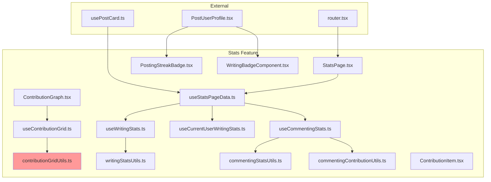

# REFACTORING ANALYSIS REPORT

**Generated**: 2026-01-04 12:00:00
**Target Feature**: `src/stats/`
**Analyst**: Claude Refactoring Specialist
**Report ID**: refactor_stats_2026-01-04_120000

---

## EXECUTIVE SUMMARY

The `src/stats` feature is a well-organized React module responsible for displaying user writing and commenting statistics with GitHub-style contribution graphs. The codebase consists of **2,257 lines** across 30 files, following the project's feature-based architecture.

### Key Findings

| Aspect | Status | Notes |
|--------|--------|-------|
| Code Organization | GOOD | Clear separation: api, components, hooks, model, utils |
| Test Coverage | MODERATE | 5 test files covering utils (~650 lines of tests) |
| Complexity Hotspots | 2 files | `contributionGridUtils.ts` (411 lines), `StatsPage.tsx` (189 lines) |
| Coupling | LOW | Only 5 external files depend on stats exports |
| Refactoring Priority | MEDIUM | Primary target: `contributionGridUtils.ts` |

### Recommended Approach

**Single-file focused refactoring** targeting `contributionGridUtils.ts`, with minor improvements to `StatsPage.tsx`. The module is overall well-designed with low external coupling.

---

## CODEBASE-WIDE CONTEXT

### Target Feature Structure

```
src/stats/
├── api/
│   └── stats.ts (91 lines)
├── components/
│   ├── ContributionGraph.tsx (80 lines)
│   ├── ContributionItem.tsx (137 lines)
│   ├── PostingStreakBadge.tsx (46 lines)
│   ├── StatsHeader.tsx (14 lines)
│   ├── StatsNoticeBanner.tsx (34 lines)
│   ├── StatsPage.tsx (189 lines)
│   ├── UserCommentStatsCard.tsx (45 lines)
│   ├── UserCommentStatsCardList.tsx (22 lines)
│   ├── UserPostingStatsCard.tsx (50 lines)
│   ├── UserPostingStatsCardList.tsx (60 lines)
│   ├── UserPostingStatsCardSkeleton.tsx (26 lines)
│   └── WritingBadgeComponent.tsx (20 lines)
├── hooks/
│   ├── useCommentingStats.ts (72 lines)
│   ├── useContributionGrid.ts (77 lines)
│   ├── useCurrentUserWritingStats.ts (41 lines)
│   ├── usePostingStreak.ts (27 lines)
│   ├── usePostProfileBadges.ts (63 lines)
│   ├── useStatsPageData.ts (93 lines)
│   └── useWritingStats.ts (72 lines)
├── model/
│   ├── WritingBadge.ts (4 lines)
│   ├── WritingStats.ts (24 lines)
│   └── WritingStatus.ts (5 lines)
└── utils/
    ├── commentingContributionUtils.ts (35 lines)
    ├── commentingStatsUtils.ts (33 lines)
    ├── contributionGridUtils.ts (411 lines) ⚠️ REFACTOR TARGET
    ├── contributionUtils.ts (24 lines)
    └── writingStatsUtils.ts (74 lines)
```

### External Dependencies ON Stats Feature

| File | Imports From Stats | Coupling Level |
|------|-------------------|----------------|
| `src/router.tsx` | `StatsPage` | LOW (route only) |
| `src/post/components/PostUserProfile.tsx` | `PostingStreakBadge`, `WritingBadgeComponent`, `WritingBadge` | MEDIUM |
| `src/post/hooks/usePostCard.ts` | `usePostingStreak`, `usePostProfileBadges` | MEDIUM |
| `src/shared/components/mockUserStats.ts` | `WritingStats` type | LOW (mock data) |
| `src/login/components/GoalSection.tsx` | Unknown stats import | LOW |

**Total External Dependents**: 5 files
**Coupling Assessment**: LOW - The stats feature is relatively isolated

### Stats Feature Dependencies (Imports FROM)

The stats feature imports from:
- `@/firebase` - Firestore integration
- `@/shared/*` - UI components, hooks, utils
- `@/user/api/*` - User and commenting data APIs
- `@/post/model/*` - Posting model

---

## CURRENT STATE ANALYSIS

### File Metrics Summary

| Metric | Value | Target | Status |
|--------|-------|--------|--------|
| Total Lines | 2,257 | - | - |
| Largest File | 411 lines | <500 | ⚠️ NEAR LIMIT |
| Test Lines | ~650 | - | - |
| Files | 30 | - | - |
| Components | 12 | - | - |
| Hooks | 7 | - | - |
| Utils | 5 | - | - |

### Files by Size (Source Only)

| File | Lines | Risk Level |
|------|-------|------------|
| `contributionGridUtils.ts` | 411 | **HIGH** |
| `StatsPage.tsx` | 189 | MEDIUM |
| `ContributionItem.tsx` | 137 | LOW |
| `useStatsPageData.ts` | 93 | LOW |
| `stats.ts` (api) | 91 | LOW |
| `ContributionGraph.tsx` | 80 | LOW |
| All other files | <80 | LOW |

### Code Smell Analysis

| Code Smell | Count | Severity | Examples |
|------------|-------|----------|----------|
| Long File | 1 | HIGH | `contributionGridUtils.ts` (411 lines) |
| Inline Components | 4 | LOW | `LoadingState`, `MaintenanceState`, `ErrorState` in `StatsPage.tsx` |
| Duplicate Type Definitions | 1 | LOW | `WritingBadge` interface defined identically in both `model/WritingBadge.ts` (standalone, 4 lines) and `model/WritingStats.ts` (nested export, lines 21-24). Both define `{ name: string; emoji: string; }`. Should consolidate to single source of truth in `WritingStats.ts`. |
| Mixed Concerns | 1 | MEDIUM | `contributionGridUtils.ts` handles time, grid, contribution logic |
| Unused Export | 1 | LOW | `WritingStatus` enum appears unused |

### Test Coverage Analysis

| File/Module | Has Tests | Test File Location | Estimated Coverage |
|-------------|-----------|-------------------|-------------------|
| `writingStatsUtils.ts` | ✅ Yes | `utils/test/writingStatsUtils.test.ts` | HIGH (~90%) |
| `commentingStatsUtils.ts` | ✅ Yes | Two separate test files exist with overlapping coverage: `utils/commentingStatsUtils.test.ts` (219 lines) and `utils/test/commentingStatsUtils.test.ts` (145 lines). Both test the same utility functions (`getTotalCommentCount`, `sortCommentingStats`) but with different test cases. Recommend merging into single file. | HIGH (~95%) |
| `commentingContributionUtils.ts` | ✅ Yes | `utils/commentingContributionUtils.test.ts` | HIGH (~90%) |
| `contributionGridUtils.ts` | ✅ Yes | `utils/test/contributionGridUtils.test.ts` | MEDIUM (~70%) |
| `contributionUtils.ts` | ❌ No | - | 0% |
| All Components | ❌ No | - | 0% |
| All Hooks | ❌ No | - | 0% |
| API (`stats.ts`) | ❌ No | - | 0% |

**Test Files Found**:
| # | File Path | Lines | Notes |
|---|-----------|-------|-------|
| 1 | `src/stats/utils/test/writingStatsUtils.test.ts` | 292 | Primary test file for writingStatsUtils |
| 2 | `src/stats/utils/test/commentingStatsUtils.test.ts` | 145 | Tests `getTotalCommentCount`, `sortCommentingStats` |
| 3 | `src/stats/utils/commentingStatsUtils.test.ts` | 219 | **Duplicate** - Tests same functions as #2 with additional cases. Should be merged with #2 into `utils/test/` directory. |
| 4 | `src/stats/utils/commentingContributionUtils.test.ts` | 169 | Tests `aggregateCommentingContributions` |
| 5 | `src/stats/utils/test/contributionGridUtils.test.ts` | 302 | Tests grid processing functions |

---

## COMPLEXITY ANALYSIS

### Function-Level Complexity (contributionGridUtils.ts)

| Function | Lines | Cyclomatic | Cognitive | Risk |
|----------|-------|------------|-----------|------|
| `processPostingContributions` | 23 | 4 | 8 | LOW |
| `processCommentingContributions` | 23 | 4 | 8 | LOW |
| `initializeGridWithPlaceholders` | 24 | 6 | 12 | MEDIUM |
| `processContributionsInGrid` | 12 | 3 | 6 | LOW |
| `calculateGridPosition` | 17 | 5 | 10 | MEDIUM |
| `placeContributionInGrid` | 12 | 3 | 6 | LOW |
| `getTimeRange` | 6 | 2 | 4 | LOW |
| `filterContributionsInTimeRange` | 6 | 2 | 4 | LOW |
| `createEmptyMatrices` | 11 | 1 | 2 | LOW |

**File-Level Assessment**:
- Total Functions: ~35 functions
- Average Function Size: ~12 lines
- Max Function Size: ~24 lines
- Pattern: Many small, focused functions - **GOOD**

### StatsPage.tsx Complexity

| Component/Function | Lines | Cyclomatic | Cognitive | Risk |
|-------------------|-------|------------|-----------|------|
| `StatsPage` (main) | 56 | 8 | 15 | MEDIUM |
| `LoadingState` | 16 | 1 | 2 | LOW |
| `MaintenanceState` | 22 | 1 | 2 | LOW |
| `ErrorState` | 12 | 1 | 2 | LOW |

### Dependency Analysis



**Note**: `contributionGridUtils.ts` is the core utility with multiple responsibilities.

---

## REFACTORING STRATEGY

### Phase 1: `contributionGridUtils.ts` Decomposition (HIGH PRIORITY)

**Current State**: 411 lines with mixed responsibilities

**Proposed Split**:

```
src/stats/utils/
├── grid/
│   ├── index.ts                    # Re-exports for backward compatibility
│   ├── types.ts                    # Grid types (GridResult, GridPosition, etc.)
│   ├── timeRange.ts                # Time calculation functions (~50 lines)
│   ├── gridPosition.ts             # Position calculation functions (~60 lines)
│   ├── gridMatrix.ts               # Matrix creation and manipulation (~80 lines)
│   ├── placeholders.ts             # Placeholder creation functions (~60 lines)
│   └── processors.ts               # Main processing functions (~80 lines)
├── contributionGridUtils.ts        # Facade re-exporting from grid/ (backward compat)
└── ... (other files unchanged)
```

**Extraction Candidates**:

| Function Group | Lines | Target File | Description |
|---------------|-------|-------------|-------------|
| Time functions | ~50 | `timeRange.ts` | `getTimeRange`, `formatDateInKoreanTimezone`, etc. |
| Position functions | ~60 | `gridPosition.ts` | `calculateGridPosition`, `isWeekendDay`, etc. |
| Matrix functions | ~80 | `gridMatrix.ts` | `createEmptyMatrices`, `updateMatricesAtPosition`, etc. |
| Placeholder functions | ~60 | `placeholders.ts` | `createPostingPlaceholder*`, `initializeGridWithPlaceholders` |
| Processing functions | ~80 | `processors.ts` | `processPostingContributions`, `processCommentingContributions` |
| Type definitions | ~30 | `types.ts` | All interfaces and type aliases |

### Phase 2: `StatsPage.tsx` Cleanup (MEDIUM PRIORITY)

**Current State**: 189 lines with inline components

**Proposed Changes**:
1. Extract `LoadingState`, `MaintenanceState`, `ErrorState` to separate file
2. Create `StatsPageStates.tsx` (~50 lines)
3. Main `StatsPage.tsx` reduces to ~140 lines

### Phase 3: Model Cleanup (LOW PRIORITY)

**Current State**: Duplicate `WritingBadge` interface

**Proposed Changes**:
1. Remove `model/WritingBadge.ts` (4 lines)
2. Keep definition only in `model/WritingStats.ts`
3. Update imports if any

### Phase 4: Test Organization (LOW PRIORITY)

**Current State**: Duplicate test file for `commentingStatsUtils`

**Proposed Changes**:
1. Merge `utils/commentingStatsUtils.test.ts` and `utils/test/commentingStatsUtils.test.ts`
2. Standardize test location to `utils/test/`

---

## RISK ASSESSMENT

### Risk Matrix

| Risk | Likelihood | Impact | Score | Mitigation |
|------|------------|--------|-------|------------|
| Breaking grid rendering | LOW | HIGH | 3 | Extensive existing tests |
| Import path changes | MEDIUM | LOW | 2 | Facade pattern with re-exports |
| Test failures | LOW | LOW | 1 | Run tests after each change |
| External dependency breaks | LOW | MEDIUM | 2 | Only 5 external files |
| Type errors | MEDIUM | LOW | 2 | TypeScript will catch |

### Technical Risks

1. **Breaking API compatibility**
   - **Risk Level**: LOW
   - **Mitigation**: Keep `contributionGridUtils.ts` as facade re-exporting all functions
   - **Impact**: External consumers won't need to change imports

2. **Grid rendering issues**
   - **Risk Level**: LOW
   - **Mitigation**: Existing test suite covers core functionality
   - **Verification**: Run full test suite after each extraction

3. **Performance regression**
   - **Risk Level**: LOW
   - **Mitigation**: No algorithm changes, only structural
   - **Verification**: Benchmark critical paths if needed

### Rollback Strategy

1. Use feature branch for all changes
2. Create tagged release before refactoring
3. Keep original file structure until all tests pass
4. Use git bisect if issues arise

---

## IMPLEMENTATION CHECKLIST

### Pre-Refactoring Tasks

```json
[
  {"id": "1", "content": "Review and approve refactoring plan", "priority": "high"},
  {"id": "2", "content": "Create backup files in backup_temp/", "priority": "critical"},
  {"id": "3", "content": "Set up feature branch 'refactor/stats-utils'", "priority": "high"},
  {"id": "4", "content": "Run existing test suite to establish baseline", "priority": "high"}
]
```

### Phase 1: contributionGridUtils.ts Decomposition

```json
[
  {"id": "5", "content": "Create src/stats/utils/grid/ directory", "priority": "high"},
  {"id": "6", "content": "Extract types to grid/types.ts", "priority": "high"},
  {"id": "7", "content": "Extract time functions to grid/timeRange.ts", "priority": "high"},
  {"id": "8", "content": "Extract position functions to grid/gridPosition.ts", "priority": "high"},
  {"id": "9", "content": "Extract matrix functions to grid/gridMatrix.ts", "priority": "high"},
  {"id": "10", "content": "Extract placeholder functions to grid/placeholders.ts", "priority": "high"},
  {"id": "11", "content": "Extract processing functions to grid/processors.ts", "priority": "high"},
  {"id": "12", "content": "Create grid/index.ts with re-exports", "priority": "high"},
  {"id": "13", "content": "Update contributionGridUtils.ts as facade", "priority": "high"},
  {"id": "14", "content": "Run test suite after phase 1", "priority": "high"}
]
```

### Phase 2: StatsPage.tsx Cleanup

```json
[
  {"id": "15", "content": "Create StatsPageStates.tsx with LoadingState, MaintenanceState, ErrorState", "priority": "medium"},
  {"id": "16", "content": "Update StatsPage.tsx to import from StatsPageStates.tsx", "priority": "medium"},
  {"id": "17", "content": "Run test suite after phase 2", "priority": "medium"}
]
```

### Phase 3: Model Cleanup

```json
[
  {"id": "18", "content": "Remove model/WritingBadge.ts duplicate", "priority": "low"},
  {"id": "19", "content": "Verify no broken imports", "priority": "low"}
]
```

### Phase 4: Test Organization

```json
[
  {"id": "20", "content": "Merge duplicate commentingStatsUtils test files", "priority": "low"},
  {"id": "21", "content": "Run full test suite", "priority": "low"}
]
```

### Post-Refactoring

```json
[
  {"id": "22", "content": "Run npm run type-check", "priority": "high"},
  {"id": "23", "content": "Run npm run lint", "priority": "medium"},
  {"id": "24", "content": "Run npm run build", "priority": "high"},
  {"id": "25", "content": "Update documentation if needed", "priority": "low"}
]
```

---

## POST-REFACTORING DOCUMENTATION UPDATES

### Expected Changes After Refactoring

**New Directory Structure**:
```
src/stats/utils/
├── grid/
│   ├── index.ts
│   ├── types.ts
│   ├── timeRange.ts
│   ├── gridPosition.ts
│   ├── gridMatrix.ts
│   ├── placeholders.ts
│   └── processors.ts
├── contributionGridUtils.ts  # Facade for backward compatibility
└── ... (unchanged)
```

**No External Changes Required**:
- External files import from `@stats/utils/contributionGridUtils`
- Facade pattern ensures zero breaking changes

---

## SUCCESS METRICS

| Metric | Current | Target | Verification |
|--------|---------|--------|--------------|
| Largest file size | 411 lines | <150 lines | `wc -l` on all files |
| Test suite passing | - | 100% | `npm run test:run` |
| Type check | - | Pass | `npm run type-check` |
| Build | - | Pass | `npm run build` |
| External API changes | - | 0 | No import changes needed |
| Code coverage | ~70% utils | Maintain | Coverage report |

---

## APPENDICES

### A. Complete File Inventory

| File Path | Lines | Has Tests |
|-----------|-------|-----------|
| `api/stats.ts` | 91 | No |
| `components/ContributionGraph.tsx` | 80 | No |
| `components/ContributionItem.tsx` | 137 | No |
| `components/PostingStreakBadge.tsx` | 46 | No |
| `components/StatsHeader.tsx` | 14 | No |
| `components/StatsNoticeBanner.tsx` | 34 | No |
| `components/StatsPage.tsx` | 189 | No |
| `components/UserCommentStatsCard.tsx` | 45 | No |
| `components/UserCommentStatsCardList.tsx` | 22 | No |
| `components/UserPostingStatsCard.tsx` | 50 | No |
| `components/UserPostingStatsCardList.tsx` | 60 | No |
| `components/UserPostingStatsCardSkeleton.tsx` | 26 | No |
| `components/WritingBadgeComponent.tsx` | 20 | No |
| `hooks/useCommentingStats.ts` | 72 | No |
| `hooks/useContributionGrid.ts` | 77 | No |
| `hooks/useCurrentUserWritingStats.ts` | 41 | No |
| `hooks/usePostingStreak.ts` | 27 | No |
| `hooks/usePostProfileBadges.ts` | 63 | No |
| `hooks/useStatsPageData.ts` | 93 | No |
| `hooks/useWritingStats.ts` | 72 | No |
| `model/WritingBadge.ts` | 4 | No |
| `model/WritingStats.ts` | 24 | No |
| `model/WritingStatus.ts` | 5 | No |
| `utils/commentingContributionUtils.ts` | 35 | Yes |
| `utils/commentingStatsUtils.ts` | 33 | Yes |
| `utils/contributionGridUtils.ts` | 411 | Yes |
| `utils/contributionUtils.ts` | 24 | No |
| `utils/writingStatsUtils.ts` | 74 | Yes |

### B. External Dependency Details

**Files importing from stats**:

1. **`src/router.tsx`** (line 13):
   ```typescript
   import StatsPage from '@/stats/components/StatsPage';
   ```

2. **`src/post/components/PostUserProfile.tsx`** (lines 3-5):
   ```typescript
   import { PostingStreakBadge } from '@/stats/components/PostingStreakBadge';
   import { WritingBadgeComponent } from '@/stats/components/WritingBadgeComponent';
   import { WritingBadge } from '@/stats/model/WritingStats';
   ```

3. **`src/post/hooks/usePostCard.ts`**:
   - Uses `usePostingStreak` and `usePostProfileBadges` hooks

4. **`src/shared/components/mockUserStats.ts`** (line 1):
   ```typescript
   import { WritingStats } from "@/stats/model/WritingStats"
   ```

### C. Code Quality Notes

**Strengths**:
1. Clear separation of concerns (api, components, hooks, model, utils)
2. Good test coverage for utility functions
3. Follows project conventions (feature-based structure)
4. Uses React Query for data fetching with proper caching
5. TypeScript types are well-defined
6. Small, focused functions in most files

**Areas for Improvement**:
1. `contributionGridUtils.ts` is too large (411 lines)
2. No component tests
3. No hook tests
4. Duplicate type definitions (`WritingBadge`)
5. Inline components in `StatsPage.tsx`

### D. Recommended Reading Order for Refactoring

1. `model/WritingStats.ts` - Core types
2. `utils/contributionGridUtils.ts` - Main refactoring target
3. `hooks/useContributionGrid.ts` - Main consumer of grid utils
4. `components/ContributionGraph.tsx` - Uses grid hook
5. `components/StatsPage.tsx` - Secondary refactoring target

---

*This report serves as a comprehensive guide for refactoring execution.
Reference this document when implementing: `reports/refactor/refactor_stats_2026-01-04_120000.md`*
