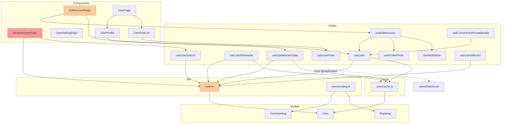

# REFACTORING ANALYSIS REPORT

**Generated**: 04-01-2026 14:45:00
**Target Feature**: `src/user`
**Analyst**: Claude Refactoring Specialist
**Report ID**: refactor_user_04-01-2026_144500

---

## EXECUTIVE SUMMARY

The `src/user` feature is a **critical, heavily-used module** (1,930 lines across 27 files) that serves as the foundation for user data management across the entire application. It is imported by 10+ other features including `post`, `comment`, `stats`, `login`, `board`, and `shared`.

**Key Findings:**
- ❌ **BlockedUsersPage.tsx (375 lines)** - Critical refactoring candidate, 4x recommended size
- ❌ **user.ts API (211 lines)** - Large file with mixed responsibilities
- ❌ **0% direct test coverage** - High risk for a core module
- ⚠️ **High coupling** - Used by 10+ other features
- ⚠️ **useInfiniteScroll dependency** - Imports from `@notification` (cross-feature)
- ✅ Good API layer separation
- ✅ Proper caching layer

**Overall Health Score**: 5/10 - Core module needs significant refactoring and testing

**Recommended Approach**: **Multi-phase refactoring** - Start with BlockedUsersPage decomposition, then add comprehensive test coverage for this critical module.

---

## CODEBASE-WIDE CONTEXT

### Related Files Discovery

**Target module is imported by** (10+ features):

| Feature | Files Using @user | Key Dependencies |
|---------|-------------------|------------------|
| `post` | 8 files | `useUser`, `fetchUser`, `buildNotInQuery`, `User` model |
| `comment` | 7 files | `useUser`, `getBlockedByUsers`, `fetchUser` |
| `stats` | 7 files | `fetchUserCommentingsByDateRange`, `User`, `Commenting` |
| `login` | 5 files | `createUserIfNotExists`, `useUserNickname`, `updateUser` |
| `board` | 4 files | `useCurrentUserKnownBuddy`, `getBlockedByUsers`, `User` |
| `shared` | 4 files | `useUser`, `User` model, `userUtils` |
| `notification` | 1 file | `useInfiniteScroll` (reverse - user imports from notification) |

**Target module imports from**:
- `@/firebase` - Firebase configuration
- `@/shared/*` - UI components, hooks, contexts
- `@/post/model/Post` - Post type (for useUserPosts)
- `@/notification/hooks/useInfiniteScroll` - Cross-feature dependency ⚠️

**Circular dependencies detected**: No direct cycles, but tight coupling with multiple features.

### Cross-Feature Dependencies

| Dependency | Direction | Concern |
|------------|-----------|---------|
| `@notification/hooks/useInfiniteScroll` | user → notification | Should be in `@shared/hooks` |
| `User` model | multiple features → user | Core type, heavily coupled |
| `buildNotInQuery` | post, comment → user | Utility function in API layer |

### Recommended Approach

- **Refactoring Strategy**: Multi-phase incremental
- **Rationale**: This is a core module with high coupling. Breaking changes would affect the entire application.
- **Priority**: HIGH - This module's instability affects 10+ other features

---

## CURRENT STATE ANALYSIS

### File Structure Overview

```
src/user/
├── api/
│   ├── user.ts              (211 lines) ⚠️ LARGE
│   └── commenting.ts        (50 lines)
├── cache/
│   └── userCache.ts         (57 lines)
├── components/
│   ├── BlockedUsersPage.tsx (375 lines) ❌ CRITICAL
│   ├── EditAccountPage.tsx  (206 lines) ⚠️ LARGE
│   ├── UserSettingPage.tsx  (135 lines)
│   ├── UserProfile.tsx      (80 lines)
│   ├── UserPostItem.tsx     (78 lines)
│   ├── UserPostList.tsx     (67 lines)
│   ├── UserPage.tsx         (43 lines)
│   ├── UserPageHeader.tsx   (34 lines)
│   └── UserKnownBuddy.tsx   (21 lines)
├── hooks/
│   ├── useUserPosts.ts      (109 lines)
│   ├── useUpdateUserData.ts (65 lines)
│   ├── useUser.ts           (44 lines)
│   ├── useUserSearch.ts     (39 lines)
│   ├── useUserNickname.ts   (35 lines)
│   ├── useEditAccount.ts    (27 lines)
│   ├── useProfilePhoto.ts   (26 lines)
│   ├── useUserInBoard.ts    (19 lines)
│   ├── useCurrentUserKnownBuddy.ts (18 lines)
│   └── useNickName.ts       (10 lines)
├── model/
│   ├── User.ts              (57 lines)
│   ├── Replying.ts          (9 lines)
│   ├── Commenting.ts        (8 lines)
│   └── UserProfile.ts       (3 lines)
└── utils/
    └── activityUtils.ts     (104 lines)
```

### File Metrics Summary Table

| File | Lines | Risk | Reason |
|------|-------|------|--------|
| BlockedUsersPage.tsx | 375 | ❌ CRITICAL | 4x recommended size, multiple responsibilities |
| user.ts (api) | 211 | ⚠️ HIGH | Large API file, mixed CRUD + utilities |
| EditAccountPage.tsx | 206 | ⚠️ HIGH | 2x recommended size, could extract components |
| UserSettingPage.tsx | 135 | ⚠️ MEDIUM | Acceptable but could be split |
| useUserPosts.ts | 109 | ⚠️ MEDIUM | Hook with embedded fetch logic |
| activityUtils.ts | 104 | ⚠️ MEDIUM | Firebase queries in utils |
| All other files | <100 | ✅ LOW | Within acceptable limits |

### Aggregate Metrics

| Metric | Value | Target | Status |
|--------|-------|--------|--------|
| Total Files | 27 | - | - |
| Source Files | 27 | - | - |
| Test Files | 0 | ≥8 | ❌ |
| Files > 200 lines | 3 | 0 | ❌ |
| Files > 100 lines | 6 | <3 | ⚠️ |
| Avg Lines/File | 71.5 | <100 | ✅ |
| Max File Lines | 375 | <200 | ❌ |
| External Imports | 10+ features | - | ⚠️ High Coupling |

---

## CODE SMELL ANALYSIS

### Critical Issues

#### 1. BlockedUsersPage.tsx - God Component (375 lines)

**Severity**: ❌ CRITICAL

This component has **multiple responsibilities**:
- User search with autocomplete
- Blocked users list management
- Block/unblock functionality
- Multiple dialog states
- Keyboard navigation

**Current Structure Analysis**:
```typescript
// Lines 25-97: SuggestionsDropdown component (already extracted - good!)
// Lines 99-375: BlockedUsersPage main component
//   - 8 useState hooks
//   - 3 useEffect hooks
//   - 5 handler functions
//   - Complex JSX with 3 major sections
```

**Recommended Decomposition**:
```
BlockedUsersPage.tsx (current: 375 lines)
├── BlockedUsersPage.tsx (orchestrator: ~80 lines)
├── BlockedUsersSearchSection.tsx (~100 lines)
├── BlockedUsersList.tsx (~80 lines)
├── BlockedUserItem.tsx (~50 lines)
├── useBlockedUsers.ts (custom hook: ~60 lines)
└── blockedUsersConstants.ts (~10 lines)
```

---

#### 2. user.ts API - Mixed Responsibilities (211 lines)

**Severity**: ⚠️ HIGH

This file contains:
- CRUD operations (fetchUser, createUser, updateUser, deleteUser)
- User blocking operations (blockUser, unblockUser, addBlockedUser, removeBlockedUser)
- User queries (fetchUsersWithBoardPermission, fetchAllUsers, getBlockedUsers, getBlockedByUsers)
- Utility functions (buildNotInQuery, createUserIfNotExists)
- File upload (uploadUserProfilePhoto)

**Recommended Split**:
```
api/
├── user.ts (CRUD operations: ~80 lines)
├── userBlocking.ts (blocking operations: ~60 lines)
├── userQueries.ts (queries: ~50 lines)
└── userStorage.ts (file uploads: ~20 lines)
```

---

#### 3. EditAccountPage.tsx - Could Extract Components (206 lines)

**Severity**: ⚠️ MEDIUM

Already has some extraction (ProfilePhotoUploader, LoadingOverlay, LoadingSkeleton), but the main component is still large.

**Minor improvements**:
- Extract form section to separate component
- Consider using a form library (react-hook-form)

---

### Other Code Smells

| Code Smell | Location | Severity | Description |
|------------|----------|----------|-------------|
| Cross-feature import | UserPostList.tsx:2 | MEDIUM | Imports `useInfiniteScroll` from `@notification` |
| any types | BlockedUsersPage.tsx | LOW | Uses `any` for user types |
| Magic numbers | BlockedUsersPage.tsx:179 | LOW | Hardcoded limit of 10 blocked users |
| Duplicate code | useUser.ts, useUserNickname.ts | LOW | Similar caching patterns |

---

## TEST COVERAGE ANALYSIS

### Current Test Coverage

| Layer | Files | Tested | Coverage |
|-------|-------|--------|----------|
| API | 2 | 0 | 0% |
| Cache | 1 | 0 | 0% |
| Components | 9 | 0 | 0% |
| Hooks | 10 | 0 | 0% |
| Model | 4 | 0 | 0% |
| Utils | 1 | 0 | 0% |
| **Total** | **27** | **0** | **0%** |

### Related Tests (in other features)

| Test File | Uses @user | What's Tested |
|-----------|------------|---------------|
| `shared/utils/userUtils.test.ts` | `User` model | User display name utilities |
| `stats/utils/commentingContributionUtils.test.ts` | `Commenting`, `Replying` models | Activity statistics |

### Critical Test Gaps

**This is a CORE module with 0% coverage used by 10+ features.**

| Priority | File | Risk | Tests Needed |
|----------|------|------|--------------|
| CRITICAL | `api/user.ts` | API changes break 10+ features | CRUD operations, error handling |
| CRITICAL | `hooks/useUser.ts` | Core data fetching | Caching, error states, loading |
| HIGH | `cache/userCache.ts` | Data persistence | Cache operations, expiration |
| HIGH | `hooks/useUpdateUserData.ts` | Data mutations | Success/error handling |
| MEDIUM | `components/BlockedUsersPage.tsx` | User-facing feature | User interactions |

### Recommended Test Strategy

**Phase 1: API Layer (CRITICAL)**
```typescript
// api/user.test.ts
describe('user API', () => {
  describe('fetchUser', () => {
    it('returns user data for valid uid');
    it('returns null for non-existent user');
    it('handles Firestore errors gracefully');
  });

  describe('createUser', () => {
    it('creates user with required fields');
    it('adds server timestamp to updatedAt');
  });

  describe('blockUser', () => {
    it('creates bidirectional block relationship');
    it('uses batch write for atomicity');
  });
});
```

**Phase 2: Hooks (HIGH)**
```typescript
// hooks/useUser.test.ts
describe('useUser', () => {
  describe('when uid is provided', () => {
    it('fetches user from cache first');
    it('fetches from Firestore if cache miss');
    it('updates cache after Firestore fetch');
  });

  describe('when uid is null', () => {
    it('returns error without fetching');
  });
});
```

---

## COMPLEXITY ANALYSIS

### Function-Level Metrics

| Function | File | Lines | Cyclomatic | Nesting | Risk |
|----------|------|-------|------------|---------|------|
| `BlockedUsersPage` | BlockedUsersPage.tsx | 276 | 12 | 4 | ❌ CRITICAL |
| `SuggestionsDropdown` | BlockedUsersPage.tsx | 72 | 5 | 3 | MEDIUM |
| `EditAccountPage` | EditAccountPage.tsx | 123 | 5 | 3 | MEDIUM |
| `fetchUserPosts` | useUserPosts.ts | 52 | 4 | 3 | LOW |
| `useUser` | useUser.ts | 35 | 3 | 1 | LOW |
| `buildNotInQuery` | user.ts | 13 | 3 | 1 | LOW |
| `getCachedUserData` | userCache.ts | 24 | 5 | 3 | LOW |

### Complexity Hotspots

**1. BlockedUsersPage.tsx - Cyclomatic Complexity: 12**

```typescript
// Decision points in main component:
// 1-3: if (!currentUser) guards
// 4: if (blockedUsers.length >= 10) limit check
// 5-8: switch (e.key) for keyboard navigation
// 9: if (searchQuery.trim()) suggestion display
// 10-12: Conditional renders in JSX
```

**Refactoring Priority**: IMMEDIATE

**2. useUserPosts.ts - Nested async complexity**

```typescript
// Lines 75-101: Nested Promise.all with try-catch
const postsWithMetadata = await Promise.all(
  postingsSnapshot.docs.map(async (postingDoc) => {
    try {
      // Nested async operation
      const postDoc = await getDoc(postRef);
      if (!postDoc.exists()) { /* handle */ }
      return { ...post, _paginationCursor: postingDoc };
    } catch (error) { return null; }
  })
);
```

**Suggestion**: Extract inner mapping to named function

---

## DEPENDENCY ANALYSIS

### Internal Dependency Graph



### External Dependencies (Other Features Importing @user)

| External Feature | Imports | Coupling Level |
|------------------|---------|----------------|
| `@post` | `User`, `fetchUser`, `buildNotInQuery`, `getBlockedByUsers` | HIGH |
| `@comment` | `useUser`, `getBlockedByUsers`, `fetchUser` | HIGH |
| `@stats` | `User`, `Commenting`, `Replying`, `fetchUserCommentings*` | HIGH |
| `@login` | `createUserIfNotExists`, `updateUser`, `useUserNickname` | HIGH |
| `@board` | `useCurrentUserKnownBuddy`, `getBlockedByUsers`, `User` | MEDIUM |
| `@shared` | `User`, `useUser` | MEDIUM |

### Coupling Risk Assessment

**This module is a critical dependency.** Changes to:
- `User` model → Affects 10+ features
- `useUser` hook → Affects 7+ components across features
- `fetchUser` API → Affects 6+ features
- `getBlockedByUsers` → Affects 5+ features

---

## REFACTORING PLAN

### Phase 0: Immediate Fixes (Priority: IMMEDIATE)

**Task 1: Add Test Coverage for Critical API Functions**

Before ANY refactoring, establish a safety net:

```bash
# Create test files
src/user/api/__tests__/user.test.ts
src/user/cache/__tests__/userCache.test.ts
src/user/hooks/__tests__/useUser.test.ts
```

**Risk Level**: HIGH if skipped
**Files Affected**: 3 new files

---

### Phase 1: BlockedUsersPage Decomposition (Priority: HIGH)

**Task 2: Extract BlockedUsersPage Components**

**BEFORE** (375 lines in one file):
```typescript
// BlockedUsersPage.tsx contains:
// - SuggestionsDropdown component
// - Main BlockedUsersPage component
// - All state management
// - All handlers
// - All UI sections
```

**AFTER** (Split into 5-6 files):
```
components/blocked-users/
├── BlockedUsersPage.tsx (~80 lines) - orchestrator
├── BlockedUsersSearchSection.tsx (~100 lines)
├── BlockedUsersList.tsx (~80 lines)
├── BlockedUserItem.tsx (~50 lines)
├── SuggestionsDropdown.tsx (~75 lines) - already exists, just move
└── index.ts (exports)

hooks/
└── useBlockedUsers.ts (~60 lines) - extract state management

constants/
└── blockedUsersConstants.ts (~15 lines) - BLOCKED_USERS_LIMIT, etc.
```

**Extraction Steps**:
1. Create `hooks/useBlockedUsers.ts` - extract state management
2. Move `SuggestionsDropdown` to separate file
3. Create `BlockedUsersList.tsx` - blocked users display
4. Create `BlockedUserItem.tsx` - single item with unblock
5. Create `BlockedUsersSearchSection.tsx` - search UI
6. Simplify main `BlockedUsersPage.tsx` to orchestrator

**Risk Level**: MEDIUM
**Files Affected**: 6 new/modified files

---

### Phase 2: API Layer Reorganization (Priority: MEDIUM)

**Task 3: Split user.ts API**

**BEFORE** (211 lines, mixed responsibilities):
```
api/user.ts
├── CRUD: fetchUser, createUser, updateUser, deleteUser
├── Blocking: blockUser, unblockUser, addBlockedUser, removeBlockedUser
├── Queries: fetchUsersWithBoardPermission, fetchAllUsers, getBlockedUsers
├── Utils: buildNotInQuery, createUserIfNotExists
└── Storage: uploadUserProfilePhoto
```

**AFTER** (Split by responsibility):
```
api/
├── user.ts (CRUD: ~60 lines)
│   ├── fetchUser
│   ├── createUser
│   ├── updateUser
│   └── deleteUser
├── userBlocking.ts (blocking: ~70 lines)
│   ├── blockUser
│   ├── unblockUser
│   ├── addBlockedUser
│   ├── removeBlockedUser
│   ├── getBlockedUsers
│   └── getBlockedByUsers
├── userQueries.ts (queries: ~50 lines)
│   ├── fetchUsersWithBoardPermission
│   ├── fetchAllUsers
│   └── buildNotInQuery
├── userStorage.ts (storage: ~20 lines)
│   └── uploadUserProfilePhoto
└── index.ts (re-exports for backwards compatibility)
```

**Risk Level**: MEDIUM (must maintain backwards compatibility)
**Files Affected**: 5 files (4 new, 1 index)

---

### Phase 3: Move Shared Hook (Priority: MEDIUM)

**Task 4: Move useInfiniteScroll to @shared**

(Same as notification report - this affects both features)

**Current**:
```
src/notification/hooks/useInfiniteScroll.ts
└── imported by src/user/components/UserPostList.tsx
```

**After**:
```
src/shared/hooks/useInfiniteScroll.ts
├── imported by src/notification/components/NotificationsPage.tsx
└── imported by src/user/components/UserPostList.tsx
```

**Risk Level**: LOW
**Files Affected**: 3 files

---

### Phase 4: EditAccountPage Simplification (Priority: LOW)

**Task 5: Simplify EditAccountPage**

Extract form logic to a separate component or consider using react-hook-form.

**Current**: 206 lines with inline form handling
**Target**: ~120 lines with extracted form component

**Risk Level**: LOW
**Files Affected**: 2 files

---

## RISK ASSESSMENT

### Risk Matrix

| Risk | Likelihood | Impact | Score | Mitigation |
|------|------------|--------|-------|------------|
| Breaking changes affect 10+ features | High | Critical | 9 | Comprehensive tests first, backwards-compatible changes |
| BlockedUsersPage refactor breaks functionality | Medium | High | 6 | Component tests before/after |
| API split breaks external imports | Medium | High | 6 | Use index.ts for re-exports |
| Test coverage gaps hide bugs | High | Medium | 6 | Prioritize API tests |
| Cache invalidation issues | Low | Medium | 3 | Test cache operations thoroughly |

### Technical Risks

**Risk 1: High Coupling with External Features**
- **Description**: User module is imported by 10+ features
- **Mitigation**:
  1. Never change public API signatures
  2. Use re-exports for backwards compatibility
  3. Add deprecation warnings before removing
- **Likelihood**: High during refactoring
- **Impact**: Critical

**Risk 2: Untested Core Module**
- **Description**: 0% test coverage on critical functionality
- **Mitigation**:
  1. Write tests BEFORE refactoring
  2. Focus on public API contract tests
  3. Use integration tests for critical paths
- **Likelihood**: Currently occurring
- **Impact**: High

### Rollback Strategy

1. Each phase should be a separate PR
2. Use feature flags for BlockedUsersPage if needed
3. Keep original files during API split (with deprecation notices)
4. Run integration tests after each change

---

## IMPLEMENTATION CHECKLIST

```json
[
  {
    "id": "1",
    "content": "Review and approve refactoring plan",
    "priority": "high",
    "status": "pending"
  },
  {
    "id": "2",
    "content": "Create test file for api/user.ts",
    "priority": "critical",
    "status": "pending"
  },
  {
    "id": "3",
    "content": "Create test file for hooks/useUser.ts",
    "priority": "critical",
    "status": "pending"
  },
  {
    "id": "4",
    "content": "Create test file for cache/userCache.ts",
    "priority": "high",
    "status": "pending"
  },
  {
    "id": "5",
    "content": "Extract useBlockedUsers hook from BlockedUsersPage",
    "priority": "high",
    "status": "pending"
  },
  {
    "id": "6",
    "content": "Extract BlockedUsersList component",
    "priority": "high",
    "status": "pending"
  },
  {
    "id": "7",
    "content": "Extract BlockedUserItem component",
    "priority": "high",
    "status": "pending"
  },
  {
    "id": "8",
    "content": "Extract BlockedUsersSearchSection component",
    "priority": "high",
    "status": "pending"
  },
  {
    "id": "9",
    "content": "Move SuggestionsDropdown to separate file",
    "priority": "medium",
    "status": "pending"
  },
  {
    "id": "10",
    "content": "Split user.ts API into focused modules",
    "priority": "medium",
    "status": "pending"
  },
  {
    "id": "11",
    "content": "Create api/index.ts for backwards compatibility",
    "priority": "medium",
    "status": "pending"
  },
  {
    "id": "12",
    "content": "Move useInfiniteScroll to @shared/hooks",
    "priority": "medium",
    "status": "pending"
  },
  {
    "id": "13",
    "content": "Run full test suite and validate all features",
    "priority": "high",
    "status": "pending"
  }
]
```

---

## POST-REFACTORING DOCUMENTATION UPDATES

### Files to Update After Refactoring

After BlockedUsersPage decomposition and API split:
- Update any architecture documentation referencing user module structure
- Update import examples if API split changes paths

### Documentation Update Checklist

```markdown
- [ ] Verify all import paths in documentation
- [ ] Update component structure documentation
- [ ] Document new API module organization
- [ ] Add deprecation notices if needed
```

---

## SUCCESS METRICS

| Metric | Current | Target | How to Measure |
|--------|---------|--------|----------------|
| Max file size | 375 lines | <150 lines | `wc -l` on largest file |
| Files > 200 lines | 3 | 0 | Count files |
| Test coverage | 0% | 60%+ | vitest --coverage |
| Cyclomatic complexity | 12 | <10 | ESLint complexity rule |
| All tests passing | N/A | ✅ | npm run test:run |

---

## APPENDICES

### A. BlockedUsersPage Detailed Analysis

**Current Component Structure**:
```
BlockedUsersPage (375 lines)
├── State (8 useState hooks)
│   ├── blockedUsers
│   ├── searchQuery
│   ├── showSuggestions
│   ├── selectedSuggestionIndex
│   ├── loading
│   ├── confirmUnblockUid
│   ├── showLimitDialog
│   └── refs (searchInputRef, suggestionsRef)
├── Effects (3 useEffect)
│   ├── Load blocked users on mount
│   ├── Handle click outside
│   └── (keyboard events handled inline)
├── Handlers (5 functions)
│   ├── handleSearchChange
│   ├── handleKeyDown
│   ├── handleBlock
│   ├── handleUnblock
│   └── clearSearch
└── JSX (4 major sections)
    ├── Header with back button
    ├── Search section with suggestions
    ├── Blocked users list
    └── Limit dialog
```

**Proposed Hook: useBlockedUsers**
```typescript
export function useBlockedUsers(currentUser: User | null) {
  const [blockedUsers, setBlockedUsers] = useState<User[]>([]);
  const [loading, setLoading] = useState(false);

  // Load blocked users
  useEffect(() => {
    if (!currentUser) return;
    loadBlockedUsers(currentUser.uid);
  }, [currentUser]);

  const blockUser = async (user: User) => { /* ... */ };
  const unblockUser = async (uid: string) => { /* ... */ };

  return {
    blockedUsers,
    loading,
    isAtLimit: blockedUsers.length >= BLOCKED_USERS_LIMIT,
    blockUser,
    unblockUser,
  };
}
```

### B. API Split Details

**Current user.ts exports**:
```typescript
// CRUD
export async function fetchUser(uid: string): Promise<User | null>
export async function createUser(data: User): Promise<void>
export async function updateUser(uid: string, data: Partial<User>): Promise<void>
export async function deleteUser(uid: string): Promise<void>

// Blocking
export async function blockUser(blockerId: string, blockedId: string)
export async function unblockUser(blockerId: string, blockedId: string)
export async function addBlockedUser(myUid: string, blockedUid: string): Promise<void>
export async function removeBlockedUser(myUid: string, blockedUid: string): Promise<void>
export async function getBlockedUsers(userId: string): Promise<string[]>
export async function getBlockedByUsers(userId: string): Promise<string[]>

// Queries
export async function fetchUsersWithBoardPermission(boardIds: string[]): Promise<User[]>
export async function fetchAllUsers(): Promise<User[]>
export function buildNotInQuery<T = any>(ref, field, notInList, ...restOrderBy): Query<T>

// Other
export async function createUserIfNotExists(user: FirebaseUser): Promise<void>
export async function uploadUserProfilePhoto(userId: string, file: File): Promise<string>
```

**Recommended index.ts for backwards compatibility**:
```typescript
// api/index.ts
export * from './user';
export * from './userBlocking';
export * from './userQueries';
export * from './userStorage';
```

### C. Test Priority Matrix

| Test File | Priority | LOE | Impact |
|-----------|----------|-----|--------|
| api/user.test.ts | CRITICAL | 4h | Validates core CRUD |
| hooks/useUser.test.ts | CRITICAL | 3h | Validates caching behavior |
| cache/userCache.test.ts | HIGH | 2h | Validates persistence |
| hooks/useUpdateUserData.test.ts | HIGH | 2h | Validates mutations |
| api/userBlocking.test.ts | HIGH | 2h | Validates block/unblock |
| components/BlockedUsersPage.test.tsx | MEDIUM | 4h | User interaction tests |

**Total estimated effort**: 17 hours

---

*This report serves as a comprehensive guide for refactoring execution.
Reference this document when implementing: `@reports/refactor/refactor_user_04-01-2026_144500.md`*
